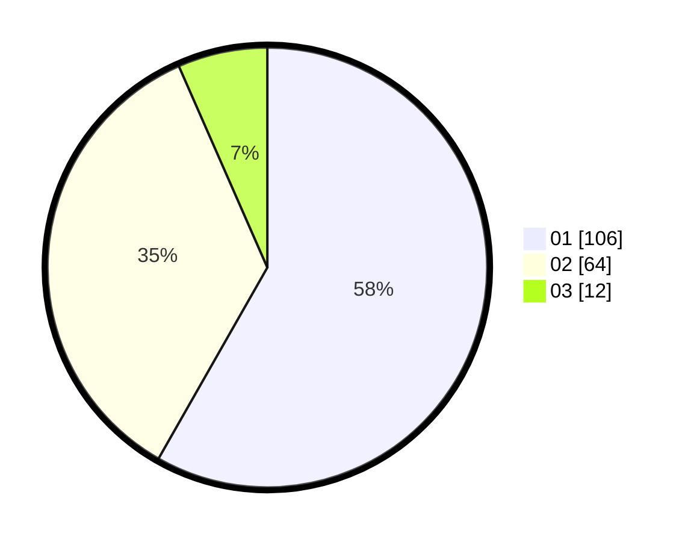

# Hasil

Hasil perolehan suara paslon dapat dilihat pada file paslon-01.txt, paslon-02.txt, dan paslon-03.txt.

Jika tidak ada, artinya data tersebut belum ada pada SIREKAP.

## Perolehan Suara

 * Paslon 01: **106**.
 * Paslon 02: **64**.
 * Paslon 03: **12**.

## Foto C Plano

https://sirekap-obj-formc.kpu.go.id/eeac/pemilu/ppwp/31/75/01/10/01/3175011001025-20240214-155534--c1e4b29b-321d-4686-adf3-72109838a25a.jpg

https://sirekap-obj-formc.kpu.go.id/eeac/pemilu/ppwp/31/75/01/10/01/3175011001025-20240214-162231--e4a6ad7f-86f1-48e4-abb7-7a7093e26676.jpg

https://sirekap-obj-formc.kpu.go.id/eeac/pemilu/ppwp/31/75/01/10/01/3175011001025-20240214-155609--316b913d-759c-4ce6-be97-d637c5ca7a33.jpg
