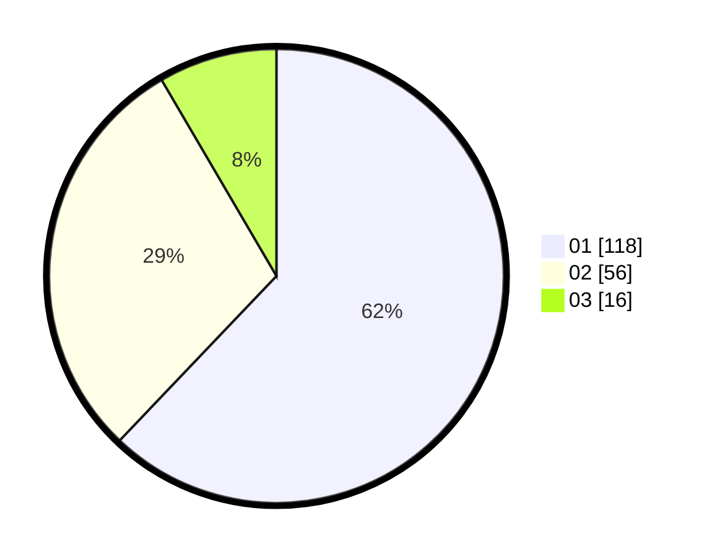

# Hasil

Hasil perolehan suara paslon dapat dilihat pada file paslon-01.txt, paslon-02.txt, dan paslon-03.txt.

Jika tidak ada, artinya data tersebut belum ada pada SIREKAP.

## Perolehan Suara

 * Paslon 01: **118**.
 * Paslon 02: **56**.
 * Paslon 03: **16**.

## Foto C Plano

https://sirekap-obj-formc.kpu.go.id/6084/pemilu/ppwp/31/75/01/10/01/3175011001029-20240214-233234--bd214dfc-7e02-4d57-961a-78bb5f0728d3.jpg

https://sirekap-obj-formc.kpu.go.id/6084/pemilu/ppwp/31/75/01/10/01/3175011001029-20240214-233420--101b4150-e2a7-4573-8487-425371b4d073.jpg

https://sirekap-obj-formc.kpu.go.id/6084/pemilu/ppwp/31/75/01/10/01/3175011001029-20240214-233508--a5e18038-1438-43bf-a39d-a55630c688fc.jpg
