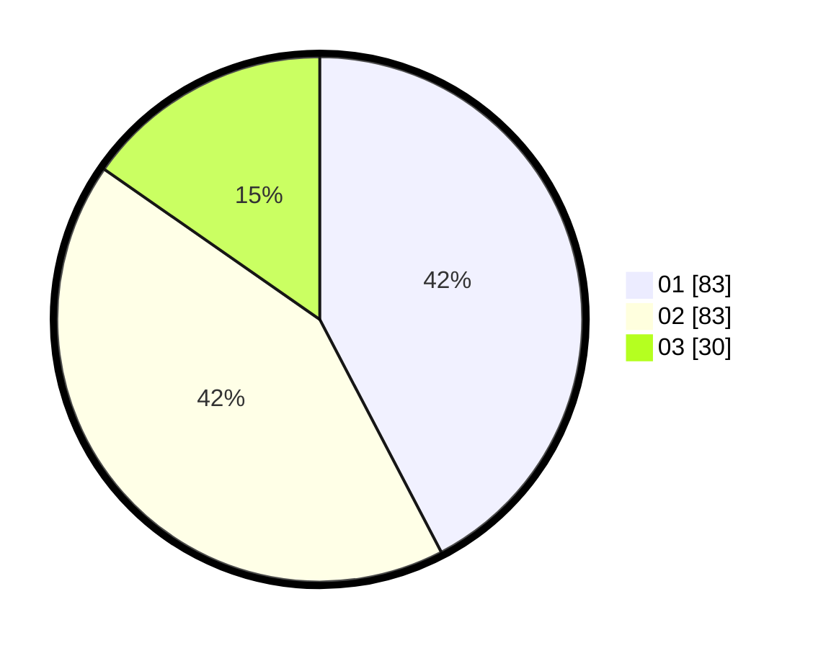

# Hasil

Hasil perolehan suara paslon dapat dilihat pada file paslon-01.txt, paslon-02.txt, dan paslon-03.txt.

Jika tidak ada, artinya data tersebut belum ada pada SIREKAP.

## Perolehan Suara

 * Paslon 01: **83**.
 * Paslon 02: **83**.
 * Paslon 03: **30**.

## Foto C Plano

https://sirekap-obj-formc.kpu.go.id/a914/pemilu/ppwp/31/75/01/10/01/3175011001033-20240215-041345--4a00174d-88d1-4f44-a477-f1552479e7ed.jpg

https://sirekap-obj-formc.kpu.go.id/a914/pemilu/ppwp/31/75/01/10/01/3175011001033-20240215-041416--14754423-eae9-40a1-becf-45fafe974a2f.jpg

https://sirekap-obj-formc.kpu.go.id/a914/pemilu/ppwp/31/75/01/10/01/3175011001033-20240215-041509--c0464dce-38ba-47c5-af16-ac242d5168a8.jpg
