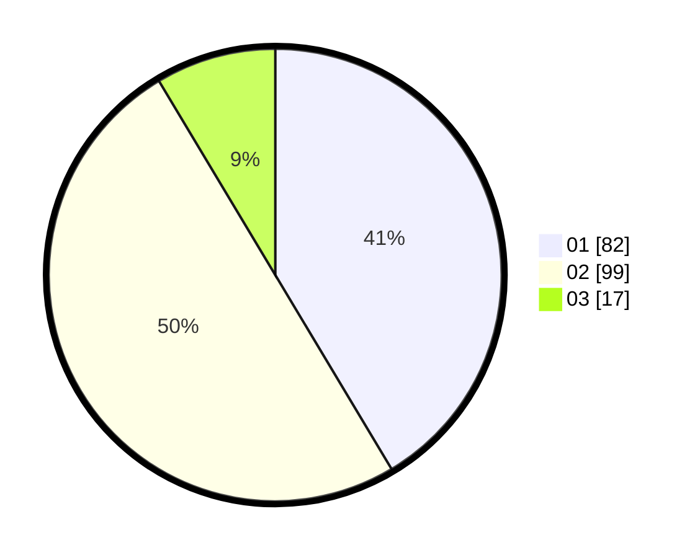

# Hasil

Hasil perolehan suara paslon dapat dilihat pada file paslon-01.txt, paslon-02.txt, dan paslon-03.txt.

Jika tidak ada, artinya data tersebut belum ada pada SIREKAP.

## Perolehan Suara

 * Paslon 01: **82**.
 * Paslon 02: **99**.
 * Paslon 03: **17**.

## Foto C Plano

https://sirekap-obj-formc.kpu.go.id/ccca/pemilu/ppwp/31/75/01/10/01/3175011001041-20240217-160228--23223648-0197-4728-a484-41ade6929239.jpg

https://sirekap-obj-formc.kpu.go.id/ccca/pemilu/ppwp/31/75/01/10/01/3175011001041-20240217-160407--36101ec6-e29f-4941-8cf6-74703686541b.jpg

https://sirekap-obj-formc.kpu.go.id/ccca/pemilu/ppwp/31/75/01/10/01/3175011001041-20240217-160535--f3e33651-4092-4a68-bb50-d761bddd9650.jpg
