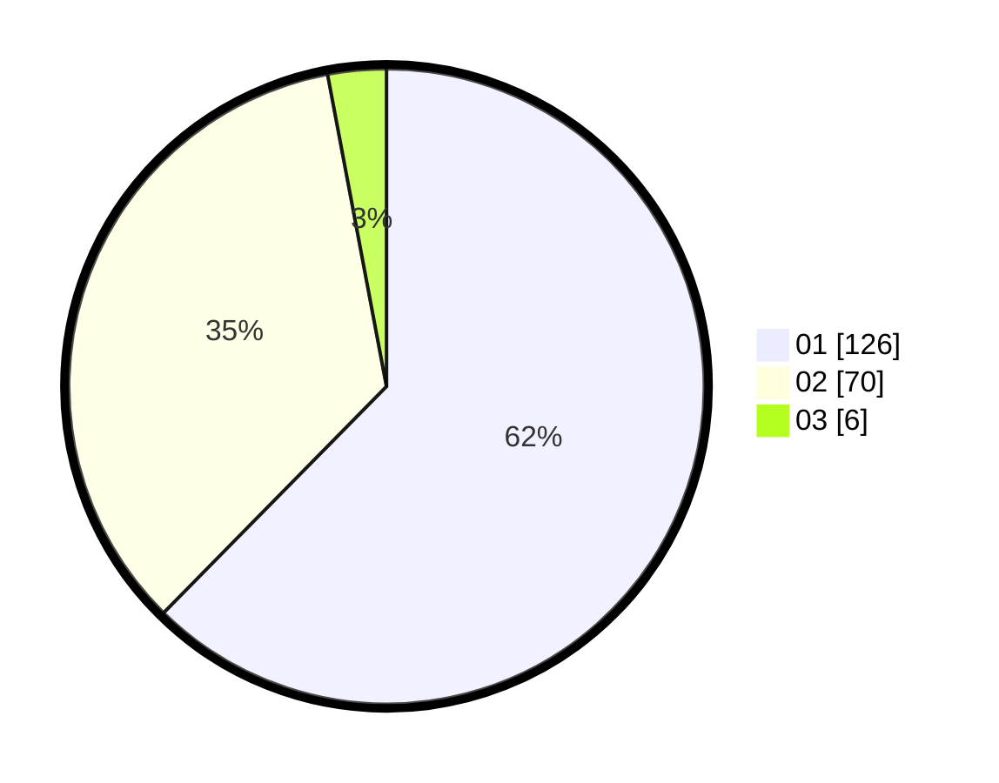

# Hasil

Hasil perolehan suara paslon dapat dilihat pada file paslon-01.txt, paslon-02.txt, dan paslon-03.txt.

Jika tidak ada, artinya data tersebut belum ada pada SIREKAP.

## Perolehan Suara

 * Paslon 01: **126**.
 * Paslon 02: **70**.
 * Paslon 03: **6**.

## Foto C Plano

https://sirekap-obj-formc.kpu.go.id/68bd/pemilu/ppwp/31/75/01/10/01/3175011001042-20240214-214616--68481385-9c26-40df-aae6-aa03ef0b54c6.jpg

https://sirekap-obj-formc.kpu.go.id/68bd/pemilu/ppwp/31/75/01/10/01/3175011001042-20240214-214722--20c273a2-095a-4ffa-93c1-722582088e8b.jpg

https://sirekap-obj-formc.kpu.go.id/68bd/pemilu/ppwp/31/75/01/10/01/3175011001042-20240214-214819--99aaed11-ae02-490f-ba32-2e20c10c54c3.jpg
