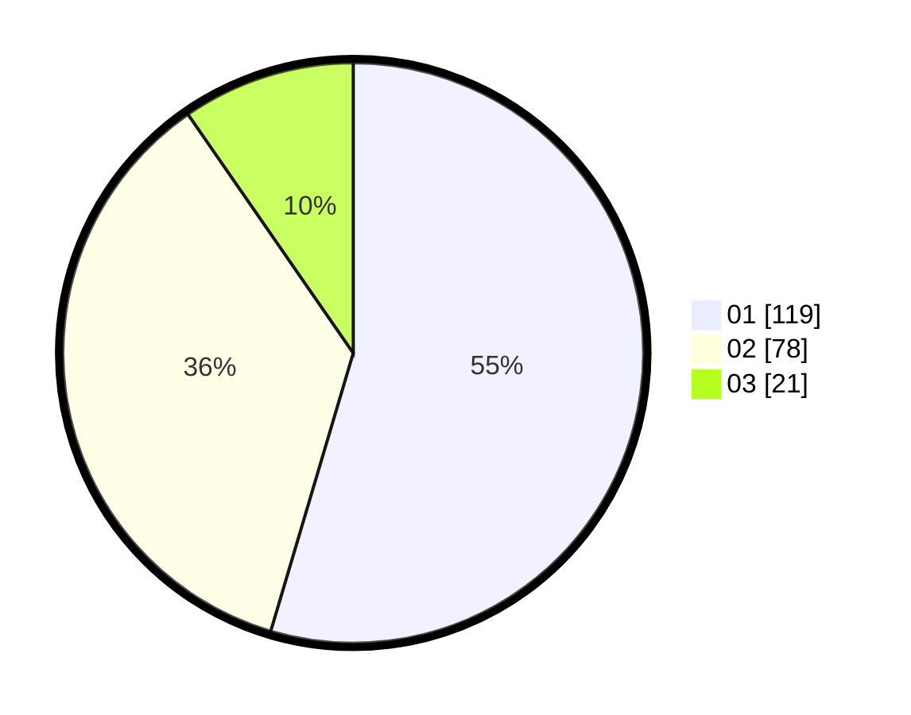

# Hasil

Hasil perolehan suara paslon dapat dilihat pada file paslon-01.txt, paslon-02.txt, dan paslon-03.txt.

Jika tidak ada, artinya data tersebut belum ada pada SIREKAP.

## Perolehan Suara

 * Paslon 01: **119**.
 * Paslon 02: **78**.
 * Paslon 03: **21**.

## Foto C Plano

https://sirekap-obj-formc.kpu.go.id/da80/pemilu/ppwp/31/75/01/10/01/3175011001049-20240214-185307--22c6b50a-47ca-41d5-bbf2-51d25c9f7212.jpg

https://sirekap-obj-formc.kpu.go.id/da80/pemilu/ppwp/31/75/01/10/01/3175011001049-20240214-175445--3fbba402-e184-49d1-8966-4e711ca27fd3.jpg

https://sirekap-obj-formc.kpu.go.id/da80/pemilu/ppwp/31/75/01/10/01/3175011001049-20240214-175444--1c87ca92-19e3-4de2-ac86-186cb17f4b3b.jpg

## DATA PEMILIH TETAP

Jumlah pemilih dalam DPT: **284**.
 * L: **134**.
 * P: **150**.

## DATA PENGGUNA HAK PILIH

Jumlah pengguna hak pilih dalam DPT: **217**.
 * L: **100**.
 * P: **117**.

Jumlah pengguna hak pilih dalam DPTb: **0**.
 * L: **0**.
 * P: **0**.

Jumlah pengguna hak pilih dalam DPK: **1**.
 * L: **0**.
 * P: **1**.

Jumlah pengguna hak pilih: **218**.
 * L: **100**.
 * P: **118**.

## JUMLAH SUARA SAH DAN TIDAK SAH

JUMLAH SELURUH SUARA SAH: **218**.

JUMLAH SUARA TIDAK SAH: **0**.

JUMLAH SELURUH SUARA SAH DAN SUARA TIDAK SAH: **218**.
