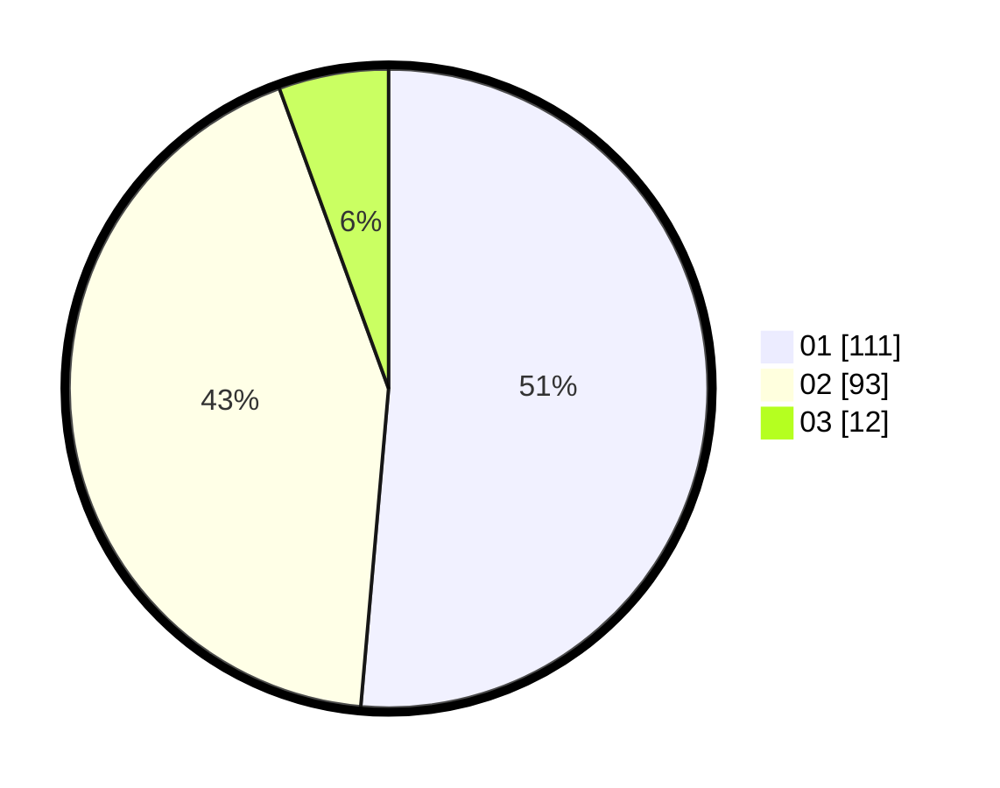

# Hasil

Hasil perolehan suara paslon dapat dilihat pada file paslon-01.txt, paslon-02.txt, dan paslon-03.txt.

Jika tidak ada, artinya data tersebut belum ada pada SIREKAP.

## Perolehan Suara

 * Paslon 01: **111**.
 * Paslon 02: **93**.
 * Paslon 03: **12**.

## Foto C Plano

https://sirekap-obj-formc.kpu.go.id/ff0b/pemilu/ppwp/31/75/01/10/01/3175011001050-20240214-205320--c0b316d4-bfc3-4470-b78e-f9a6a213268d.jpg

https://sirekap-obj-formc.kpu.go.id/ff0b/pemilu/ppwp/31/75/01/10/01/3175011001050-20240214-210655--35ae90c4-78e6-4029-8111-e60afe3010c4.jpg

https://sirekap-obj-formc.kpu.go.id/ff0b/pemilu/ppwp/31/75/01/10/01/3175011001050-20240214-202420--2a6e76ca-b147-411a-b2c4-ef9b7e57e3c5.jpg

## DATA PEMILIH TETAP

Jumlah pemilih dalam DPT: **275**.
 * L: **143**.
 * P: **132**.

## DATA PENGGUNA HAK PILIH

Jumlah pengguna hak pilih dalam DPT: **214**.
 * L: **115**.
 * P: **99**.

Jumlah pengguna hak pilih dalam DPTb: **0**.
 * L: **0**.
 * P: **0**.

Jumlah pengguna hak pilih dalam DPK: **2**.
 * L: **1**.
 * P: **1**.

Jumlah pengguna hak pilih: **216**.
 * L: **116**.
 * P: **100**.

## JUMLAH SUARA SAH DAN TIDAK SAH

JUMLAH SELURUH SUARA SAH: **216**.

JUMLAH SUARA TIDAK SAH: **0**.

JUMLAH SELURUH SUARA SAH DAN SUARA TIDAK SAH: **216**.
