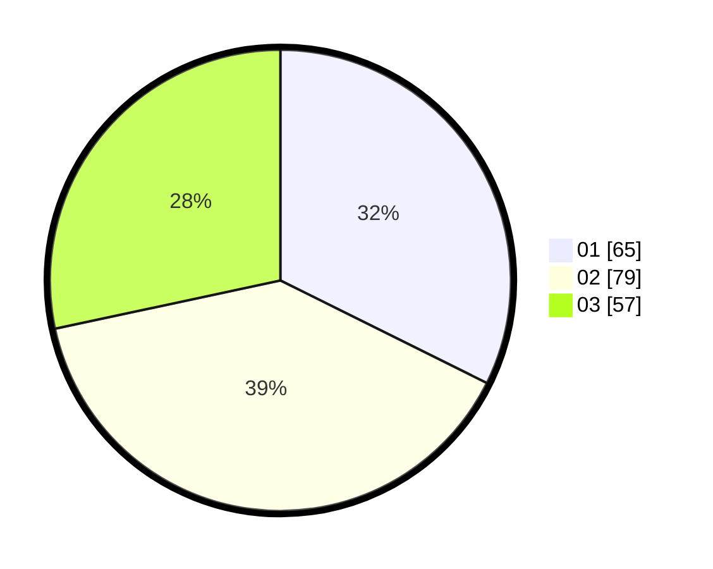

# Hasil

Hasil perolehan suara paslon dapat dilihat pada file paslon-01.txt, paslon-02.txt, dan paslon-03.txt.

Jika tidak ada, artinya data tersebut belum ada pada SIREKAP.

## Perolehan Suara

 * Paslon 01: **65**.
 * Paslon 02: **79**.
 * Paslon 03: **57**.

## Foto C Plano

https://sirekap-obj-formc.kpu.go.id/5f6d/pemilu/ppwp/31/75/01/10/01/3175011001054-20240214-213451--98dc1290-7d6e-4d4f-963d-7418e8c423a4.jpg

https://sirekap-obj-formc.kpu.go.id/5f6d/pemilu/ppwp/31/75/01/10/01/3175011001054-20240214-213055--1d5b648c-7134-4381-893a-b535648e1d99.jpg

https://sirekap-obj-formc.kpu.go.id/5f6d/pemilu/ppwp/31/75/01/10/01/3175011001054-20240214-213131--ac1510a5-e426-4a60-89b5-ebe05d6c73b1.jpg

## DATA PEMILIH TETAP

Jumlah pemilih dalam DPT: **274**.
 * L: **138**.
 * P: **136**.

## DATA PENGGUNA HAK PILIH

Jumlah pengguna hak pilih dalam DPT: **202**.
 * L: **95**.
 * P: **107**.

Jumlah pengguna hak pilih dalam DPTb: **0**.
 * L: **0**.
 * P: **0**.

Jumlah pengguna hak pilih dalam DPK: **0**.
 * L: **0**.
 * P: **0**.

Jumlah pengguna hak pilih: **202**.
 * L: **95**.
 * P: **107**.

## JUMLAH SUARA SAH DAN TIDAK SAH

JUMLAH SELURUH SUARA SAH: **201**.

JUMLAH SUARA TIDAK SAH: **1**.

JUMLAH SELURUH SUARA SAH DAN SUARA TIDAK SAH: **202**.
