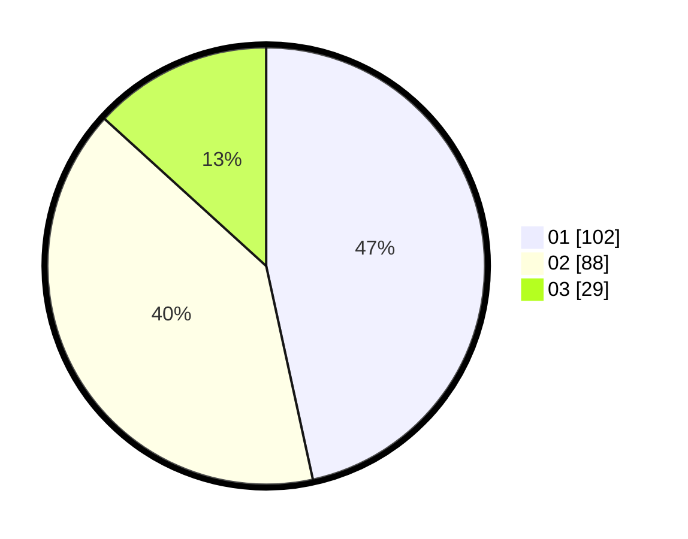

# Hasil

Hasil perolehan suara paslon dapat dilihat pada file paslon-01.txt, paslon-02.txt, dan paslon-03.txt.

Jika tidak ada, artinya data tersebut belum ada pada SIREKAP.

## Perolehan Suara

 * Paslon 01: **102**.
 * Paslon 02: **88**.
 * Paslon 03: **29**.

## Foto C Plano

https://sirekap-obj-formc.kpu.go.id/3fc8/pemilu/ppwp/31/75/01/10/01/3175011001055-20240215-002955--52cea0e2-6901-400b-b14e-0d45a50cf40e.jpg

https://sirekap-obj-formc.kpu.go.id/3fc8/pemilu/ppwp/31/75/01/10/01/3175011001055-20240215-003209--8176a098-0324-4ab9-8564-680a85fff513.jpg

https://sirekap-obj-formc.kpu.go.id/3fc8/pemilu/ppwp/31/75/01/10/01/3175011001055-20240215-003414--7ba6f688-69b6-4ded-b8a8-b7f3482e5eb8.jpg

## DATA PEMILIH TETAP

Jumlah pemilih dalam DPT: **280**.
 * L: **143**.
 * P: **137**.

## DATA PENGGUNA HAK PILIH

Jumlah pengguna hak pilih dalam DPT: **217**.
 * L: **111**.
 * P: **106**.

Jumlah pengguna hak pilih dalam DPTb: **0**.
 * L: **0**.
 * P: **0**.

Jumlah pengguna hak pilih dalam DPK: **2**.
 * L: **2**.
 * P: **0**.

Jumlah pengguna hak pilih: **219**.
 * L: **113**.
 * P: **106**.

## JUMLAH SUARA SAH DAN TIDAK SAH

JUMLAH SELURUH SUARA SAH: **219**.

JUMLAH SUARA TIDAK SAH: **0**.

JUMLAH SELURUH SUARA SAH DAN SUARA TIDAK SAH: **219**.
