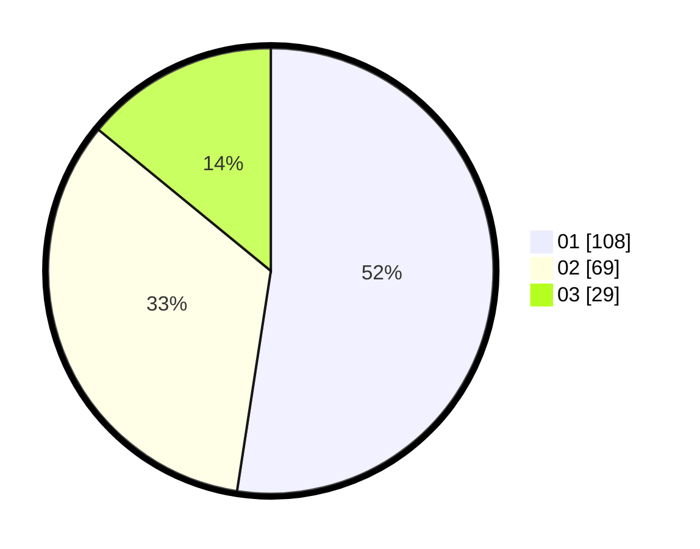

# Hasil

Hasil perolehan suara paslon dapat dilihat pada file paslon-01.txt, paslon-02.txt, dan paslon-03.txt.

Jika tidak ada, artinya data tersebut belum ada pada SIREKAP.

## Perolehan Suara

 * Paslon 01: **108**.
 * Paslon 02: **69**.
 * Paslon 03: **29**.

## Foto C Plano

https://sirekap-obj-formc.kpu.go.id/87da/pemilu/ppwp/31/75/01/10/01/3175011001056-20240214-195837--a7a2580e-9249-402e-b706-8b7e6e4bca6c.jpg

https://sirekap-obj-formc.kpu.go.id/87da/pemilu/ppwp/31/75/01/10/01/3175011001056-20240214-200247--793bcd9f-bf62-4dcb-bc3b-a29f5632503f.jpg

https://sirekap-obj-formc.kpu.go.id/87da/pemilu/ppwp/31/75/01/10/01/3175011001056-20240214-200515--a1975379-a8e9-4260-9999-74264edf480f.jpg

## DATA PEMILIH TETAP

Jumlah pemilih dalam DPT: **281**.
 * L: **140**.
 * P: **141**.

## DATA PENGGUNA HAK PILIH

Jumlah pengguna hak pilih dalam DPT: **205**.
 * L: **102**.
 * P: **103**.

Jumlah pengguna hak pilih dalam DPTb: **0**.
 * L: **0**.
 * P: **0**.

Jumlah pengguna hak pilih dalam DPK: **2**.
 * L: **1**.
 * P: **1**.

Jumlah pengguna hak pilih: **207**.
 * L: **103**.
 * P: **104**.

## JUMLAH SUARA SAH DAN TIDAK SAH

JUMLAH SELURUH SUARA SAH: **206**.

JUMLAH SUARA TIDAK SAH: **1**.

JUMLAH SELURUH SUARA SAH DAN SUARA TIDAK SAH: **207**.
