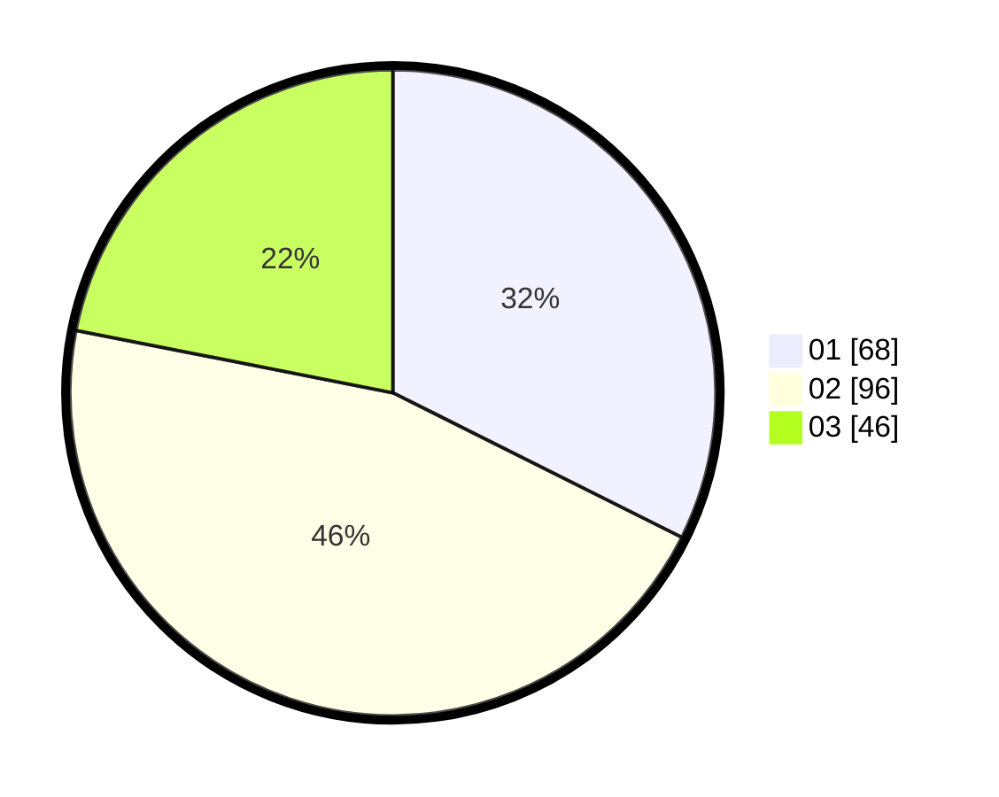

# Hasil

Hasil perolehan suara paslon dapat dilihat pada file paslon-01.txt, paslon-02.txt, dan paslon-03.txt.

Jika tidak ada, artinya data tersebut belum ada pada SIREKAP.

## Perolehan Suara

 * Paslon 01: **68**.
 * Paslon 02: **96**.
 * Paslon 03: **46**.

## Foto C Plano

https://sirekap-obj-formc.kpu.go.id/fdad/pemilu/ppwp/31/75/01/10/01/3175011001059-20240215-004146--309f2e0f-7693-4645-8ff9-5b7b05a8fdde.jpg

https://sirekap-obj-formc.kpu.go.id/fdad/pemilu/ppwp/31/75/01/10/01/3175011001059-20240215-004256--bb38fbc5-adfd-4ec3-897f-6ba327d4b0ec.jpg

https://sirekap-obj-formc.kpu.go.id/fdad/pemilu/ppwp/31/75/01/10/01/3175011001059-20240215-004516--a8287995-2020-460e-a652-f875c5734555.jpg
