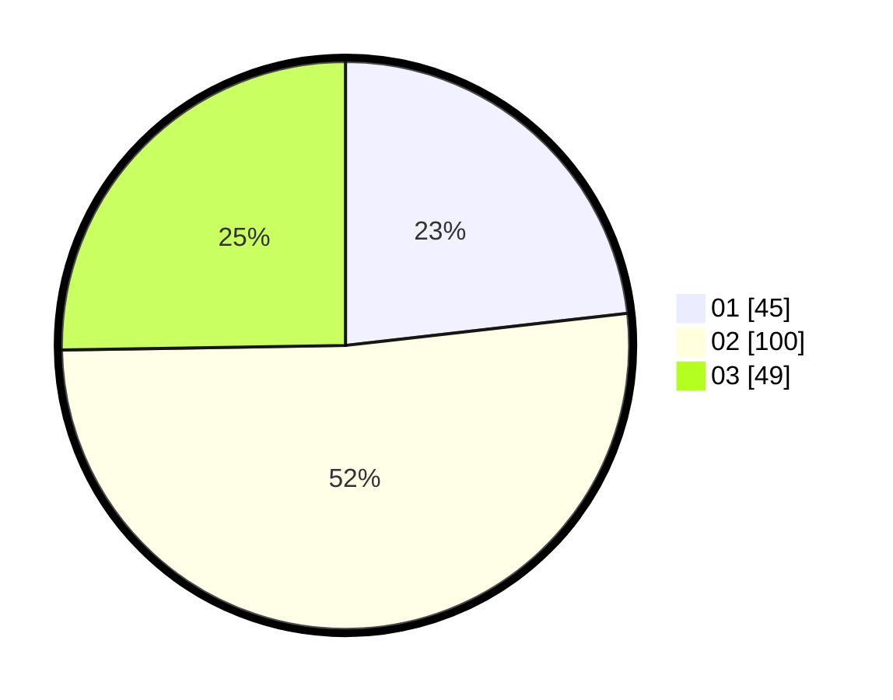

# Hasil

Hasil perolehan suara paslon dapat dilihat pada file paslon-01.txt, paslon-02.txt, dan paslon-03.txt.

Jika tidak ada, artinya data tersebut belum ada pada SIREKAP.

## Perolehan Suara

 * Paslon 01: **45**.
 * Paslon 02: **100**.
 * Paslon 03: **49**.

## Foto C Plano

https://sirekap-obj-formc.kpu.go.id/bfec/pemilu/ppwp/31/75/01/10/01/3175011001063-20240214-220022--c9d7c7d9-353c-460c-8d59-1bbb1d53b8cf.jpg

https://sirekap-obj-formc.kpu.go.id/bfec/pemilu/ppwp/31/75/01/10/01/3175011001063-20240214-220201--d7216569-de1a-4cd3-87e9-32aaa964f6b0.jpg

https://sirekap-obj-formc.kpu.go.id/bfec/pemilu/ppwp/31/75/01/10/01/3175011001063-20240214-221928--96c6c8bb-3cd4-423f-9d5e-6d3ea85fac9d.jpg
