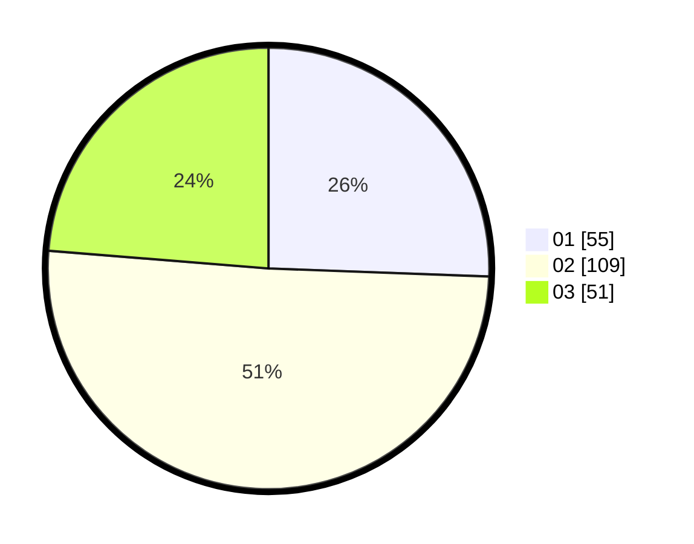

# Hasil

Hasil perolehan suara paslon dapat dilihat pada file paslon-01.txt, paslon-02.txt, dan paslon-03.txt.

Jika tidak ada, artinya data tersebut belum ada pada SIREKAP.

## Perolehan Suara

 * Paslon 01: **55**.
 * Paslon 02: **109**.
 * Paslon 03: **51**.

## Foto C Plano

https://sirekap-obj-formc.kpu.go.id/0ea0/pemilu/ppwp/31/75/01/10/01/3175011001064-20240216-120024--9701ddd2-9baf-418d-b4b0-9030f7dbf74b.jpg

https://sirekap-obj-formc.kpu.go.id/0ea0/pemilu/ppwp/31/75/01/10/01/3175011001064-20240216-060243--fb388c9f-eb35-4a0b-be93-c9cd2af5050b.jpg

https://sirekap-obj-formc.kpu.go.id/0ea0/pemilu/ppwp/31/75/01/10/01/3175011001064-20240216-060242--add702cd-f2a6-4c00-959f-9349049953d7.jpg

## DATA PEMILIH TETAP

Jumlah pemilih dalam DPT: **264**.
 * L: **138**.
 * P: **126**.

## DATA PENGGUNA HAK PILIH

Jumlah pengguna hak pilih dalam DPT: **218**.
 * L: **109**.
 * P: **109**.

Jumlah pengguna hak pilih dalam DPTb: **0**.
 * L: **0**.
 * P: **0**.

Jumlah pengguna hak pilih dalam DPK: **1**.
 * L: **1**.
 * P: **0**.

Jumlah pengguna hak pilih: **219**.
 * L: **110**.
 * P: **109**.

## JUMLAH SUARA SAH DAN TIDAK SAH

JUMLAH SELURUH SUARA SAH: **215**.

JUMLAH SUARA TIDAK SAH: **4**.

JUMLAH SELURUH SUARA SAH DAN SUARA TIDAK SAH: **219**.
