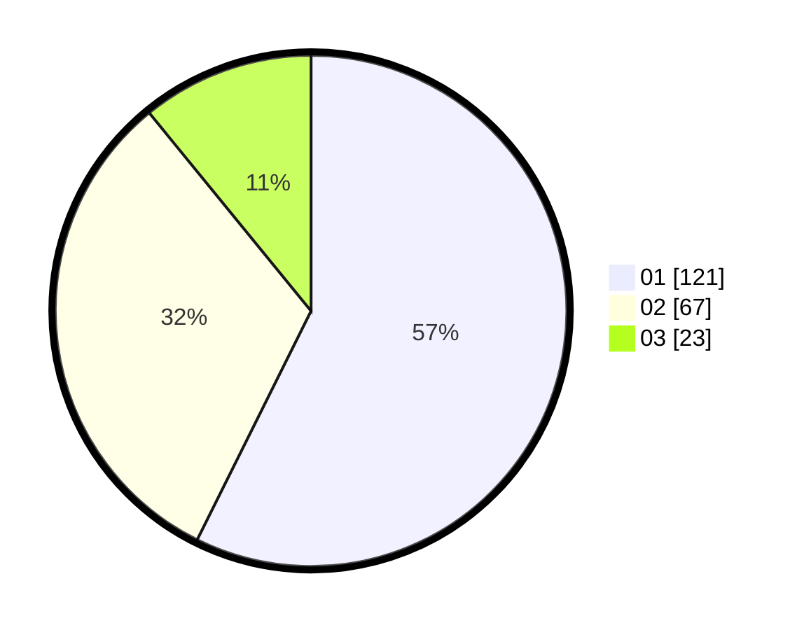

# Hasil

Hasil perolehan suara paslon dapat dilihat pada file paslon-01.txt, paslon-02.txt, dan paslon-03.txt.

Jika tidak ada, artinya data tersebut belum ada pada SIREKAP.

## Perolehan Suara

 * Paslon 01: **121**.
 * Paslon 02: **67**.
 * Paslon 03: **23**.

## Foto C Plano

https://sirekap-obj-formc.kpu.go.id/e680/pemilu/ppwp/31/75/01/10/01/3175011001072-20240215-171124--c0ce39da-ce5e-4857-bf0e-6d7c95e6fbfe.jpg

https://sirekap-obj-formc.kpu.go.id/e680/pemilu/ppwp/31/75/01/10/01/3175011001072-20240215-171239--13084379-f2f0-4c86-9296-7b17633fe1ff.jpg

https://sirekap-obj-formc.kpu.go.id/e680/pemilu/ppwp/31/75/01/10/01/3175011001072-20240215-171334--e5610fee-5764-4eb4-9a2a-5c8418cbc76b.jpg
