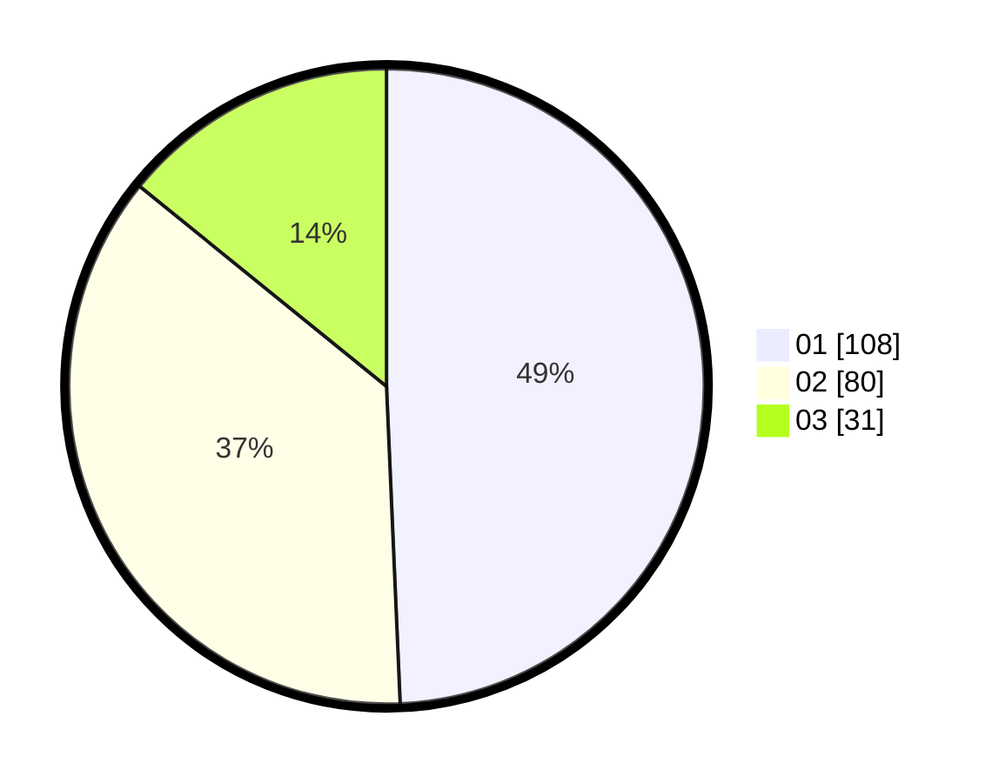

# Hasil

Hasil perolehan suara paslon dapat dilihat pada file paslon-01.txt, paslon-02.txt, dan paslon-03.txt.

Jika tidak ada, artinya data tersebut belum ada pada SIREKAP.

## Perolehan Suara

 * Paslon 01: **108**.
 * Paslon 02: **80**.
 * Paslon 03: **31**.

## Foto C Plano

https://sirekap-obj-formc.kpu.go.id/402d/pemilu/ppwp/31/75/01/10/01/3175011001076-20240214-162229--48da7807-3e33-47a6-9f2b-c5ef8aca3124.jpg

https://sirekap-obj-formc.kpu.go.id/402d/pemilu/ppwp/31/75/01/10/01/3175011001076-20240214-185021--e31d0a40-3c4c-4ab3-957f-027a14c569be.jpg

https://sirekap-obj-formc.kpu.go.id/402d/pemilu/ppwp/31/75/01/10/01/3175011001076-20240214-185026--74e92fdb-8162-4cec-90c8-701bd3811db7.jpg

## DATA PEMILIH TETAP

Jumlah pemilih dalam DPT: **280**.
 * L: **144**.
 * P: **136**.

## DATA PENGGUNA HAK PILIH

Jumlah pengguna hak pilih dalam DPT: **219**.
 * L: **112**.
 * P: **107**.

Jumlah pengguna hak pilih dalam DPTb: **0**.
 * L: **0**.
 * P: **0**.

Jumlah pengguna hak pilih dalam DPK: **1**.
 * L: **0**.
 * P: **1**.

Jumlah pengguna hak pilih: **220**.
 * L: **112**.
 * P: **108**.

## JUMLAH SUARA SAH DAN TIDAK SAH

JUMLAH SELURUH SUARA SAH: **219**.

JUMLAH SUARA TIDAK SAH: **1**.

JUMLAH SELURUH SUARA SAH DAN SUARA TIDAK SAH: **220**.
