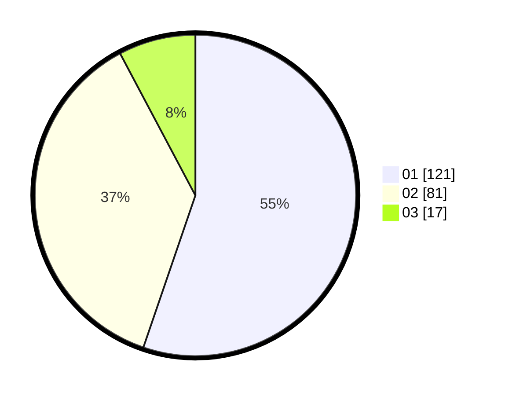

# Hasil

Hasil perolehan suara paslon dapat dilihat pada file paslon-01.txt, paslon-02.txt, dan paslon-03.txt.

Jika tidak ada, artinya data tersebut belum ada pada SIREKAP.

## Perolehan Suara

 * Paslon 01: **121**.
 * Paslon 02: **81**.
 * Paslon 03: **17**.

## Foto C Plano

https://sirekap-obj-formc.kpu.go.id/d78b/pemilu/ppwp/31/75/01/10/01/3175011001077-20240214-235937--60bbad4b-8a9b-4e4c-8944-b309d907cf2a.jpg

https://sirekap-obj-formc.kpu.go.id/d78b/pemilu/ppwp/31/75/01/10/01/3175011001077-20240214-235941--bc572679-cfd2-4bd6-9f8c-50e44c3ac3af.jpg

https://sirekap-obj-formc.kpu.go.id/d78b/pemilu/ppwp/31/75/01/10/01/3175011001077-20240216-184621--94b2eedb-78e6-4a75-b6e8-c248d230ec35.jpg
