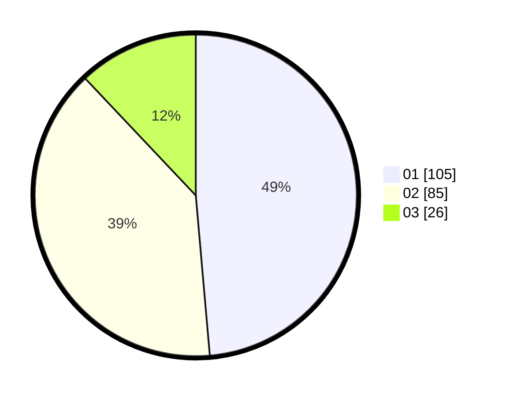

# Hasil

Hasil perolehan suara paslon dapat dilihat pada file paslon-01.txt, paslon-02.txt, dan paslon-03.txt.

Jika tidak ada, artinya data tersebut belum ada pada SIREKAP.

## Perolehan Suara

 * Paslon 01: **105**.
 * Paslon 02: **85**.
 * Paslon 03: **26**.

## Foto C Plano

https://sirekap-obj-formc.kpu.go.id/8b6c/pemilu/ppwp/31/75/01/10/01/3175011001081-20240214-233302--631d012f-5d22-4927-8606-5677dbcead3f.jpg

https://sirekap-obj-formc.kpu.go.id/8b6c/pemilu/ppwp/31/75/01/10/01/3175011001081-20240214-210404--a0a4e255-85c2-477c-b53a-6c76e1a91528.jpg

https://sirekap-obj-formc.kpu.go.id/8b6c/pemilu/ppwp/31/75/01/10/01/3175011001081-20240214-233426--4b777843-6a6e-471b-80eb-88ffc385ffa1.jpg
