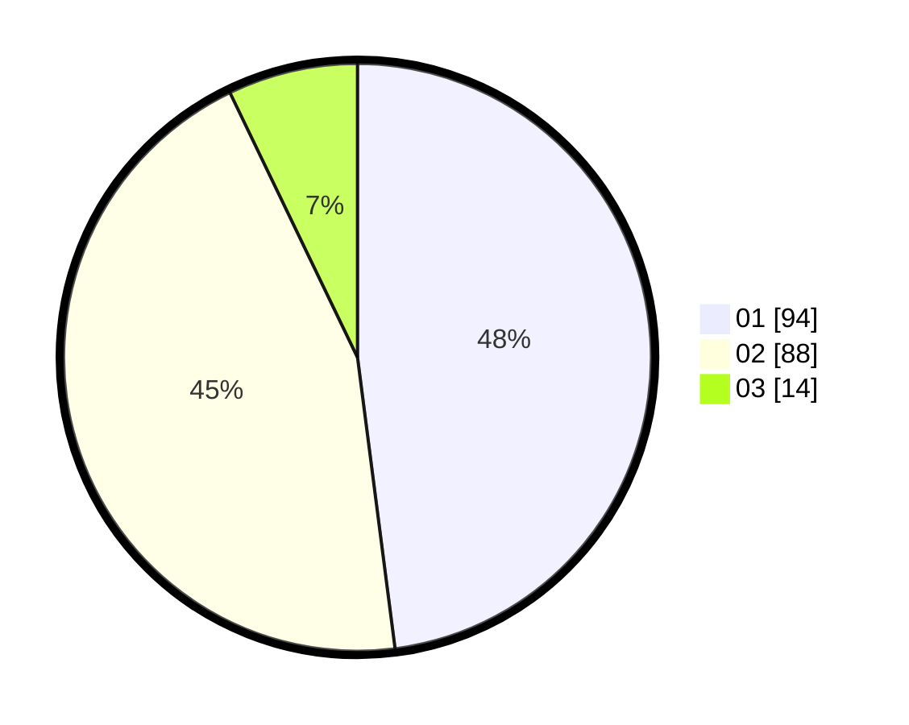

# Hasil

Hasil perolehan suara paslon dapat dilihat pada file paslon-01.txt, paslon-02.txt, dan paslon-03.txt.

Jika tidak ada, artinya data tersebut belum ada pada SIREKAP.

## Perolehan Suara

 * Paslon 01: **94**.
 * Paslon 02: **88**.
 * Paslon 03: **14**.

## Foto C Plano

https://sirekap-obj-formc.kpu.go.id/5a2a/pemilu/ppwp/31/75/01/10/01/3175011001082-20240215-031044--ed87a457-bbf1-417c-957b-5c0524f8922c.jpg

https://sirekap-obj-formc.kpu.go.id/5a2a/pemilu/ppwp/31/75/01/10/01/3175011001082-20240216-144756--b681aeb0-b918-4b3c-a041-10a3cd0f709e.jpg

https://sirekap-obj-formc.kpu.go.id/5a2a/pemilu/ppwp/31/75/01/10/01/3175011001082-20240214-185628--96cb3ddc-9652-4ab2-acaf-72df12502850.jpg

## DATA PEMILIH TETAP

Jumlah pemilih dalam DPT: **261**.
 * L: **133**.
 * P: **128**.

## DATA PENGGUNA HAK PILIH

Jumlah pengguna hak pilih dalam DPT: **192**.
 * L: **95**.
 * P: **97**.

Jumlah pengguna hak pilih dalam DPTb: **2**.
 * L: **1**.
 * P: **1**.

Jumlah pengguna hak pilih dalam DPK: **7**.
 * L: **3**.
 * P: **4**.

Jumlah pengguna hak pilih: **201**.
 * L: **99**.
 * P: **102**.

## JUMLAH SUARA SAH DAN TIDAK SAH

JUMLAH SELURUH SUARA SAH: **196**.

JUMLAH SUARA TIDAK SAH: **5**.

JUMLAH SELURUH SUARA SAH DAN SUARA TIDAK SAH: **201**.
