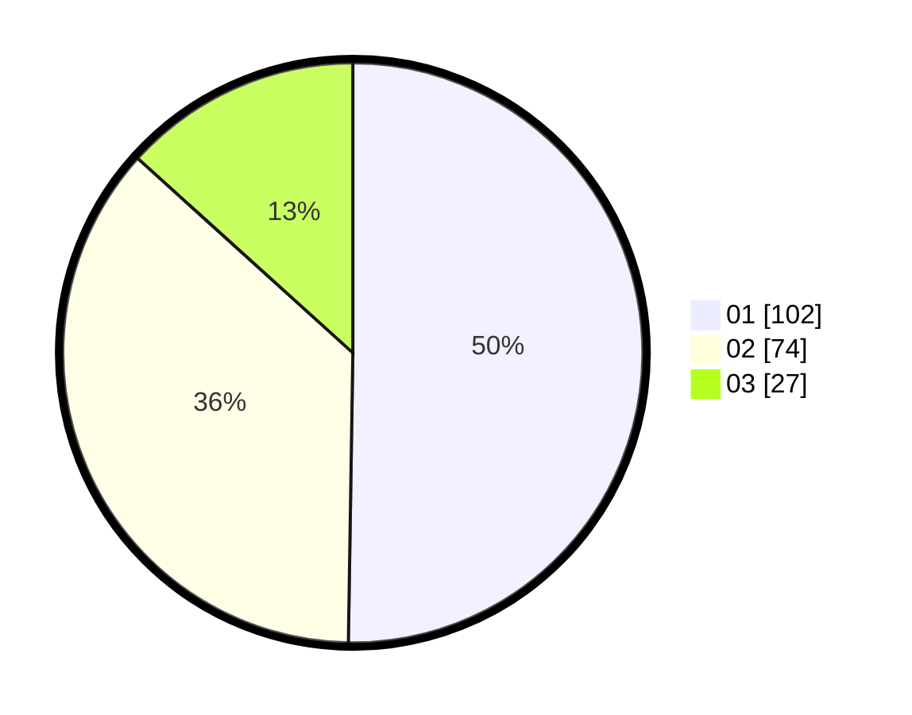

# Hasil

Hasil perolehan suara paslon dapat dilihat pada file paslon-01.txt, paslon-02.txt, dan paslon-03.txt.

Jika tidak ada, artinya data tersebut belum ada pada SIREKAP.

## Perolehan Suara

 * Paslon 01: **102**.
 * Paslon 02: **74**.
 * Paslon 03: **27**.

## Foto C Plano

https://sirekap-obj-formc.kpu.go.id/815f/pemilu/ppwp/31/75/01/10/01/3175011001083-20240216-041748--59a4d2a7-3b40-4465-8503-ab9f71ace0fd.jpg

https://sirekap-obj-formc.kpu.go.id/815f/pemilu/ppwp/31/75/01/10/01/3175011001083-20240214-155112--cca9c8dc-0897-49c3-9db0-8a1f732b8dca.jpg

https://sirekap-obj-formc.kpu.go.id/815f/pemilu/ppwp/31/75/01/10/01/3175011001083-20240216-041749--c6761f73-223e-442a-b96b-083f9dafe7ea.jpg

## DATA PEMILIH TETAP

Jumlah pemilih dalam DPT: **255**.
 * L: **126**.
 * P: **129**.

## DATA PENGGUNA HAK PILIH

Jumlah pengguna hak pilih dalam DPT: **206**.
 * L: **95**.
 * P: **111**.

Jumlah pengguna hak pilih dalam DPTb: **0**.
 * L: **0**.
 * P: **0**.

Jumlah pengguna hak pilih dalam DPK: **0**.
 * L: **0**.
 * P: **0**.

Jumlah pengguna hak pilih: **206**.
 * L: **95**.
 * P: **111**.

## JUMLAH SUARA SAH DAN TIDAK SAH

JUMLAH SELURUH SUARA SAH: **203**.

JUMLAH SUARA TIDAK SAH: **3**.

JUMLAH SELURUH SUARA SAH DAN SUARA TIDAK SAH: **206**.
