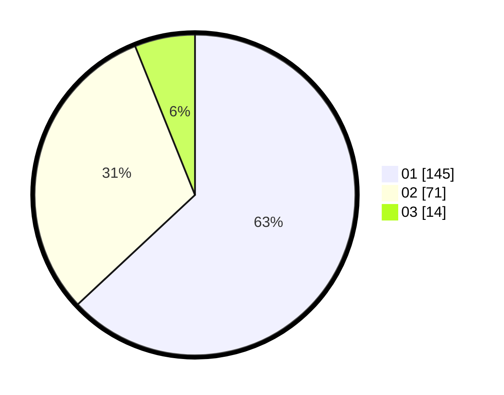

# Hasil

Hasil perolehan suara paslon dapat dilihat pada file paslon-01.txt, paslon-02.txt, dan paslon-03.txt.

Jika tidak ada, artinya data tersebut belum ada pada SIREKAP.

## Perolehan Suara

 * Paslon 01: **145**.
 * Paslon 02: **71**.
 * Paslon 03: **14**.

## Foto C Plano

https://sirekap-obj-formc.kpu.go.id/6904/pemilu/ppwp/31/75/01/10/01/3175011001089-20240214-205146--57a28278-318f-4484-baf2-b860e4f2a257.jpg

https://sirekap-obj-formc.kpu.go.id/6904/pemilu/ppwp/31/75/01/10/01/3175011001089-20240214-223153--e2131b1b-c011-4ee8-9217-4df8a1828b02.jpg

https://sirekap-obj-formc.kpu.go.id/6904/pemilu/ppwp/31/75/01/10/01/3175011001089-20240214-211023--6de16cc9-7f8c-49a8-8e44-7ce85ba6684c.jpg

## DATA PEMILIH TETAP

Jumlah pemilih dalam DPT: **295**.
 * L: **141**.
 * P: **154**.

## DATA PENGGUNA HAK PILIH

Jumlah pengguna hak pilih dalam DPT: **235**.
 * L: **109**.
 * P: **126**.

Jumlah pengguna hak pilih dalam DPTb: **0**.
 * L: **0**.
 * P: **0**.

Jumlah pengguna hak pilih dalam DPK: **0**.
 * L: **0**.
 * P: **0**.

Jumlah pengguna hak pilih: **235**.
 * L: **109**.
 * P: **126**.

## JUMLAH SUARA SAH DAN TIDAK SAH

JUMLAH SELURUH SUARA SAH: **230**.

JUMLAH SUARA TIDAK SAH: **5**.

JUMLAH SELURUH SUARA SAH DAN SUARA TIDAK SAH: **235**.
