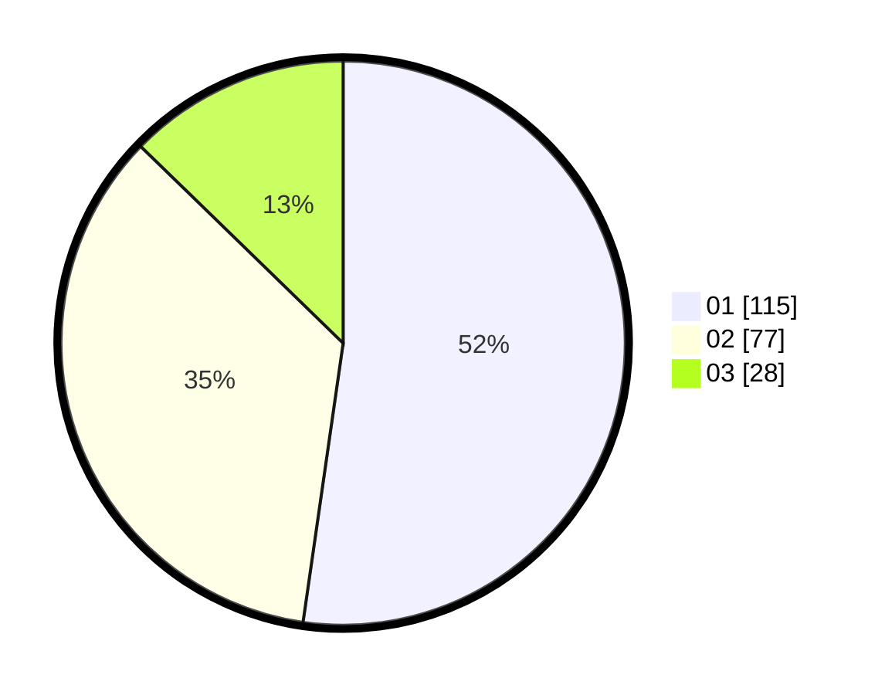

# Hasil

Hasil perolehan suara paslon dapat dilihat pada file paslon-01.txt, paslon-02.txt, dan paslon-03.txt.

Jika tidak ada, artinya data tersebut belum ada pada SIREKAP.

## Perolehan Suara

 * Paslon 01: **115**.
 * Paslon 02: **77**.
 * Paslon 03: **28**.

## Foto C Plano

https://sirekap-obj-formc.kpu.go.id/e634/pemilu/ppwp/31/75/01/10/01/3175011001094-20240214-190618--bd7be815-4511-4cb7-a2ab-be0e37728067.jpg

https://sirekap-obj-formc.kpu.go.id/e634/pemilu/ppwp/31/75/01/10/01/3175011001094-20240214-160101--2833df98-4d12-4212-9012-6acc5ef68a7d.jpg

https://sirekap-obj-formc.kpu.go.id/e634/pemilu/ppwp/31/75/01/10/01/3175011001094-20240214-190623--41ddfc51-43b4-498b-9f78-94b10727a636.jpg

## DATA PEMILIH TETAP

Jumlah pemilih dalam DPT: **288**.
 * L: **142**.
 * P: **146**.

## DATA PENGGUNA HAK PILIH

Jumlah pengguna hak pilih dalam DPT: **219**.
 * L: **98**.
 * P: **121**.

Jumlah pengguna hak pilih dalam DPTb: **0**.
 * L: **0**.
 * P: **0**.

Jumlah pengguna hak pilih dalam DPK: **5**.
 * L: **3**.
 * P: **2**.

Jumlah pengguna hak pilih: **224**.
 * L: **101**.
 * P: **123**.

## JUMLAH SUARA SAH DAN TIDAK SAH

JUMLAH SELURUH SUARA SAH: **220**.

JUMLAH SUARA TIDAK SAH: **4**.

JUMLAH SELURUH SUARA SAH DAN SUARA TIDAK SAH: **224**.
