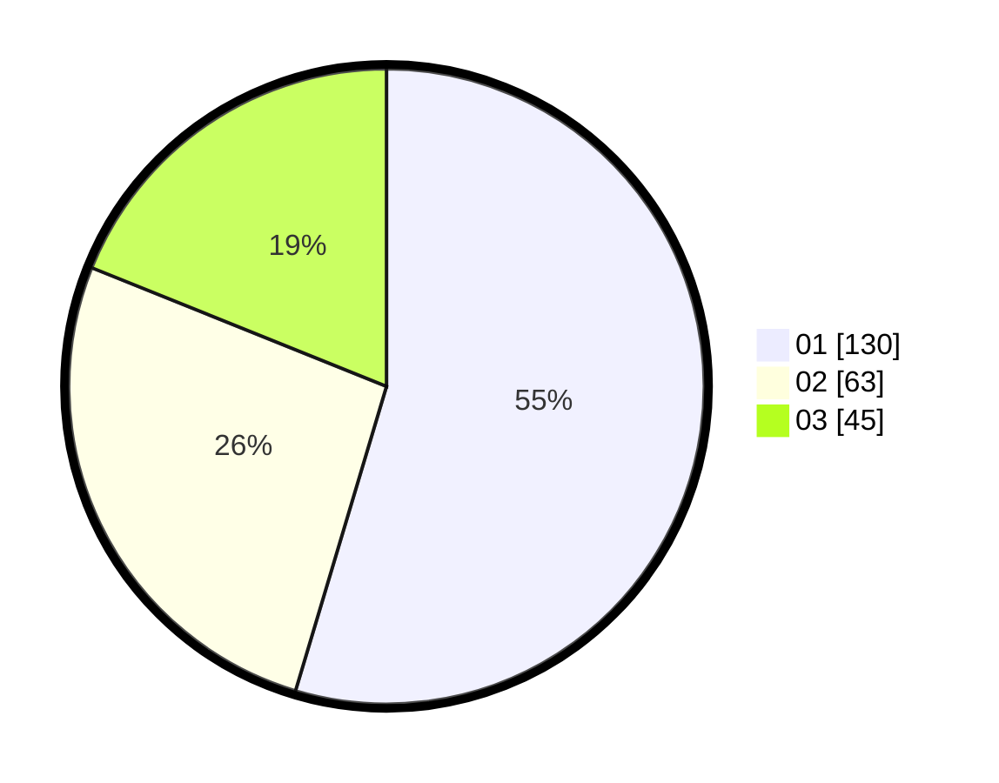

# Hasil

Hasil perolehan suara paslon dapat dilihat pada file paslon-01.txt, paslon-02.txt, dan paslon-03.txt.

Jika tidak ada, artinya data tersebut belum ada pada SIREKAP.

## Perolehan Suara

 * Paslon 01: **130**.
 * Paslon 02: **63**.
 * Paslon 03: **45**.

## Foto C Plano

https://sirekap-obj-formc.kpu.go.id/412d/pemilu/ppwp/31/75/01/10/01/3175011001095-20240214-215255--3a209354-b6b7-4fa9-98c1-ef3a6033cf41.jpg

https://sirekap-obj-formc.kpu.go.id/412d/pemilu/ppwp/31/75/01/10/01/3175011001095-20240214-215350--06200347-d727-450e-8969-1d8cd349cadd.jpg

https://sirekap-obj-formc.kpu.go.id/412d/pemilu/ppwp/31/75/01/10/01/3175011001095-20240214-215551--6eeb49d3-6143-4d0e-9e5d-413d434b562b.jpg

## DATA PEMILIH TETAP

Jumlah pemilih dalam DPT: **288**.
 * L: **130**.
 * P: **158**.

## DATA PENGGUNA HAK PILIH

Jumlah pengguna hak pilih dalam DPT: **234**.
 * L: **106**.
 * P: **128**.

Jumlah pengguna hak pilih dalam DPTb: **3**.
 * L: **1**.
 * P: **2**.

Jumlah pengguna hak pilih dalam DPK: **1**.
 * L: **1**.
 * P: **0**.

Jumlah pengguna hak pilih: **238**.
 * L: **108**.
 * P: **130**.

## JUMLAH SUARA SAH DAN TIDAK SAH

JUMLAH SELURUH SUARA SAH: **238**.

JUMLAH SUARA TIDAK SAH: **0**.

JUMLAH SELURUH SUARA SAH DAN SUARA TIDAK SAH: **238**.
