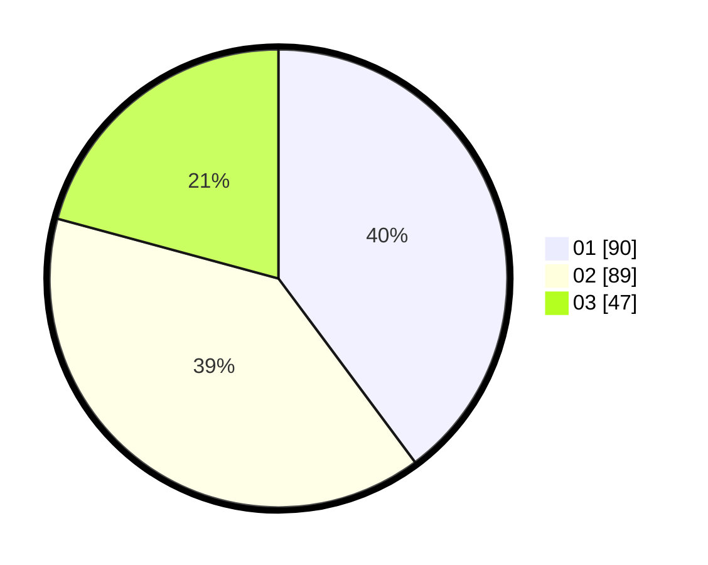

# Hasil

Hasil perolehan suara paslon dapat dilihat pada file paslon-01.txt, paslon-02.txt, dan paslon-03.txt.

Jika tidak ada, artinya data tersebut belum ada pada SIREKAP.

## Perolehan Suara

 * Paslon 01: **90**.
 * Paslon 02: **89**.
 * Paslon 03: **47**.

## Foto C Plano

https://sirekap-obj-formc.kpu.go.id/cc10/pemilu/ppwp/31/75/01/10/01/3175011001100-20240214-194810--2b222767-8d80-43ba-a977-2882501f006a.jpg

https://sirekap-obj-formc.kpu.go.id/cc10/pemilu/ppwp/31/75/01/10/01/3175011001100-20240214-194817--f271b40e-5f40-4cc3-8fc7-2e9a570afb5c.jpg

https://sirekap-obj-formc.kpu.go.id/cc10/pemilu/ppwp/31/75/01/10/01/3175011001100-20240214-194823--666cff58-8e38-4cc9-b613-86f7bd0bac56.jpg

## DATA PEMILIH TETAP

Jumlah pemilih dalam DPT: **278**.
 * L: **144**.
 * P: **134**.

## DATA PENGGUNA HAK PILIH

Jumlah pengguna hak pilih dalam DPT: **224**.
 * L: **115**.
 * P: **109**.

Jumlah pengguna hak pilih dalam DPTb: **4**.
 * L: **2**.
 * P: **2**.

Jumlah pengguna hak pilih dalam DPK: **2**.
 * L: **1**.
 * P: **1**.

Jumlah pengguna hak pilih: **230**.
 * L: **118**.
 * P: **112**.

## JUMLAH SUARA SAH DAN TIDAK SAH

JUMLAH SELURUH SUARA SAH: **226**.

JUMLAH SUARA TIDAK SAH: **4**.

JUMLAH SELURUH SUARA SAH DAN SUARA TIDAK SAH: **230**.
