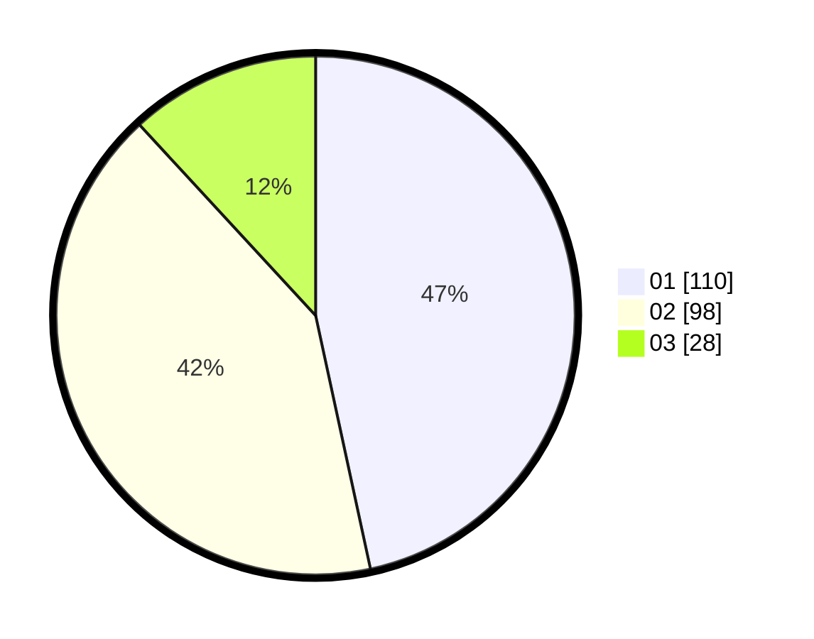

# Hasil

Hasil perolehan suara paslon dapat dilihat pada file paslon-01.txt, paslon-02.txt, dan paslon-03.txt.

Jika tidak ada, artinya data tersebut belum ada pada SIREKAP.

## Perolehan Suara

 * Paslon 01: **110**.
 * Paslon 02: **98**.
 * Paslon 03: **28**.

## Foto C Plano

https://sirekap-obj-formc.kpu.go.id/8268/pemilu/ppwp/31/75/01/10/01/3175011001101-20240214-193523--9f07a7cf-ba56-42d2-90bc-09caab01588c.jpg

https://sirekap-obj-formc.kpu.go.id/8268/pemilu/ppwp/31/75/01/10/01/3175011001101-20240214-191836--49da6faf-81bf-4809-8e5b-f87937002032.jpg

https://sirekap-obj-formc.kpu.go.id/8268/pemilu/ppwp/31/75/01/10/01/3175011001101-20240214-192023--704636eb-0de1-4c98-b0c4-76e9cc27b285.jpg

## DATA PEMILIH TETAP

Jumlah pemilih dalam DPT: **278**.
 * L: **150**.
 * P: **128**.

## DATA PENGGUNA HAK PILIH

Jumlah pengguna hak pilih dalam DPT: **230**.
 * L: **123**.
 * P: **107**.

Jumlah pengguna hak pilih dalam DPTb: **9**.
 * L: **5**.
 * P: **4**.

Jumlah pengguna hak pilih dalam DPK: **2**.
 * L: **0**.
 * P: **2**.

Jumlah pengguna hak pilih: **241**.
 * L: **128**.
 * P: **113**.

## JUMLAH SUARA SAH DAN TIDAK SAH

JUMLAH SELURUH SUARA SAH: **236**.

JUMLAH SUARA TIDAK SAH: **5**.

JUMLAH SELURUH SUARA SAH DAN SUARA TIDAK SAH: **241**.
