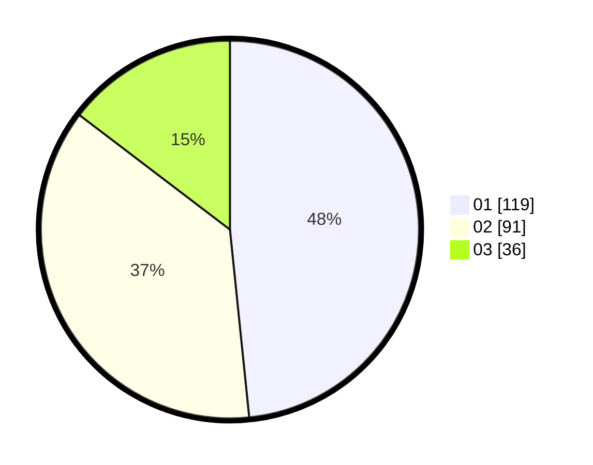

# Hasil

Hasil perolehan suara paslon dapat dilihat pada file paslon-01.txt, paslon-02.txt, dan paslon-03.txt.

Jika tidak ada, artinya data tersebut belum ada pada SIREKAP.

## Perolehan Suara

 * Paslon 01: **119**.
 * Paslon 02: **91**.
 * Paslon 03: **36**.

## Foto C Plano

https://sirekap-obj-formc.kpu.go.id/02a2/pemilu/ppwp/31/75/01/10/01/3175011001102-20240215-004813--3420f164-868f-4be8-a1f5-7c35b0adfeb5.jpg

https://sirekap-obj-formc.kpu.go.id/02a2/pemilu/ppwp/31/75/01/10/01/3175011001102-20240215-004845--fff6eb40-3e01-4da5-b36f-dfd6a1f956e5.jpg

https://sirekap-obj-formc.kpu.go.id/02a2/pemilu/ppwp/31/75/01/10/01/3175011001102-20240215-004921--19faa52b-9212-4880-a1b7-5197167dbbfb.jpg
