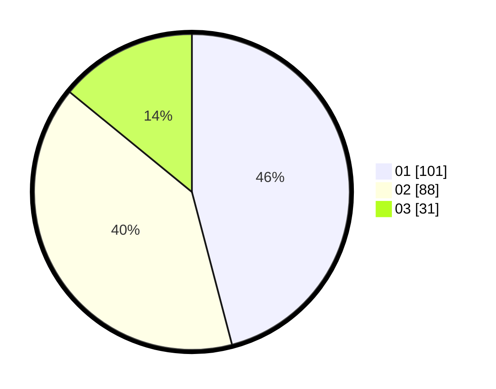

# Hasil

Hasil perolehan suara paslon dapat dilihat pada file paslon-01.txt, paslon-02.txt, dan paslon-03.txt.

Jika tidak ada, artinya data tersebut belum ada pada SIREKAP.

## Perolehan Suara

 * Paslon 01: **101**.
 * Paslon 02: **88**.
 * Paslon 03: **31**.

## Foto C Plano

https://sirekap-obj-formc.kpu.go.id/27fc/pemilu/ppwp/31/75/01/10/01/3175011001104-20240214-155524--e4adae4a-d857-4b94-adca-9128b063f093.jpg

https://sirekap-obj-formc.kpu.go.id/27fc/pemilu/ppwp/31/75/01/10/01/3175011001104-20240214-155613--2dcc0645-d57b-4051-b40b-b0ae59aee476.jpg

https://sirekap-obj-formc.kpu.go.id/27fc/pemilu/ppwp/31/75/01/10/01/3175011001104-20240214-155701--47fca1df-1964-482d-8863-ed3c5c6b56c1.jpg

## DATA PEMILIH TETAP

Jumlah pemilih dalam DPT: **282**.
 * L: **137**.
 * P: **145**.

## DATA PENGGUNA HAK PILIH

Jumlah pengguna hak pilih dalam DPT: **224**.
 * L: **99**.
 * P: **125**.

Jumlah pengguna hak pilih dalam DPTb: **1**.
 * L: **1**.
 * P: **0**.

Jumlah pengguna hak pilih dalam DPK: **2**.
 * L: **0**.
 * P: **2**.

Jumlah pengguna hak pilih: **227**.
 * L: **100**.
 * P: **127**.

## JUMLAH SUARA SAH DAN TIDAK SAH

JUMLAH SELURUH SUARA SAH: **220**.

JUMLAH SUARA TIDAK SAH: **7**.

JUMLAH SELURUH SUARA SAH DAN SUARA TIDAK SAH: **227**.
