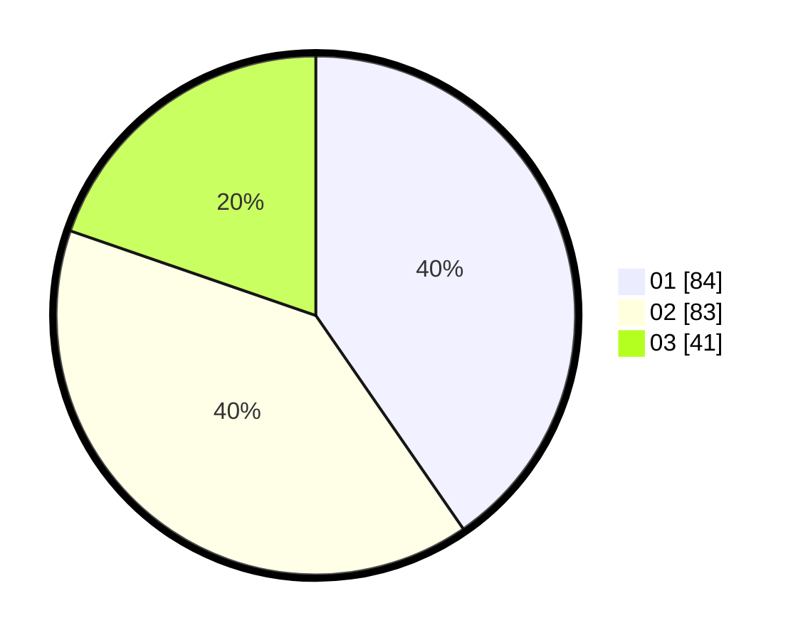

# Hasil

Hasil perolehan suara paslon dapat dilihat pada file paslon-01.txt, paslon-02.txt, dan paslon-03.txt.

Jika tidak ada, artinya data tersebut belum ada pada SIREKAP.

## Perolehan Suara

 * Paslon 01: **84**.
 * Paslon 02: **83**.
 * Paslon 03: **41**.

## Foto C Plano

https://sirekap-obj-formc.kpu.go.id/c4f4/pemilu/ppwp/31/75/01/10/01/3175011001105-20240214-224239--d58ddd85-44f6-464a-9ff3-ac638b6a3527.jpg

https://sirekap-obj-formc.kpu.go.id/c4f4/pemilu/ppwp/31/75/01/10/01/3175011001105-20240214-155900--1ecba5d7-b141-47de-8c99-a9b7c1b56fed.jpg

https://sirekap-obj-formc.kpu.go.id/c4f4/pemilu/ppwp/31/75/01/10/01/3175011001105-20240214-160133--a5256290-00eb-4e2b-892b-a8d9dfba4577.jpg
