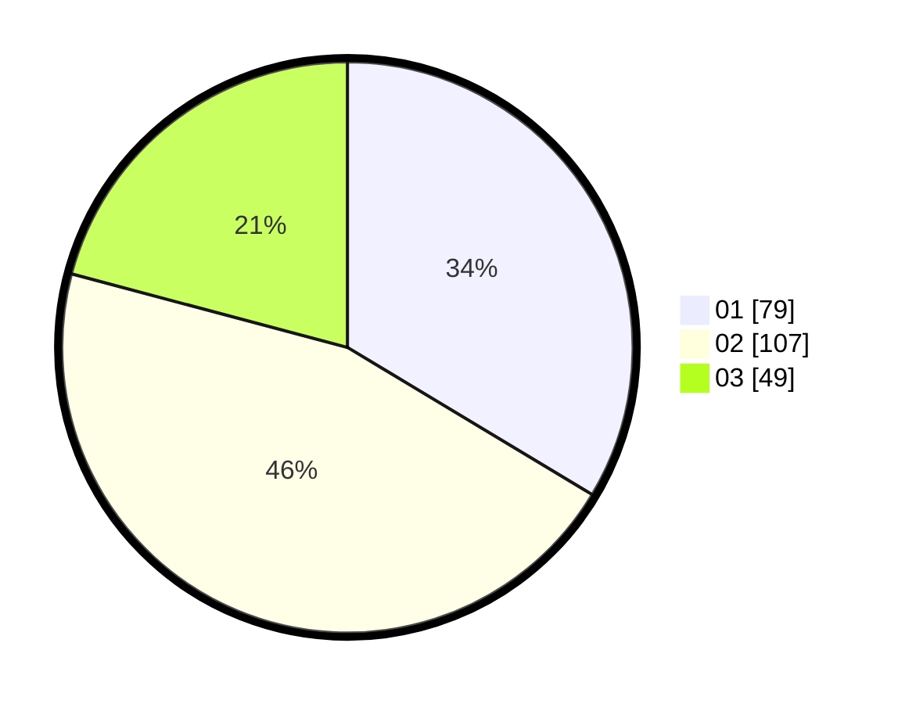

# Hasil

Hasil perolehan suara paslon dapat dilihat pada file paslon-01.txt, paslon-02.txt, dan paslon-03.txt.

Jika tidak ada, artinya data tersebut belum ada pada SIREKAP.

## Perolehan Suara

 * Paslon 01: **79**.
 * Paslon 02: **107**.
 * Paslon 03: **49**.

## Foto C Plano

https://sirekap-obj-formc.kpu.go.id/b0a5/pemilu/ppwp/31/75/01/10/01/3175011001107-20240214-211416--d14cec16-4a2e-45d6-b7da-83e29310c348.jpg

https://sirekap-obj-formc.kpu.go.id/b0a5/pemilu/ppwp/31/75/01/10/01/3175011001107-20240214-211432--bd31024b-5fe7-452e-bebf-718dfed98a59.jpg

https://sirekap-obj-formc.kpu.go.id/b0a5/pemilu/ppwp/31/75/01/10/01/3175011001107-20240214-231054--06111211-37a8-459b-b40c-9b21569ebd7f.jpg

## DATA PEMILIH TETAP

Jumlah pemilih dalam DPT: **271**.
 * L: **125**.
 * P: **146**.

## DATA PENGGUNA HAK PILIH

Jumlah pengguna hak pilih dalam DPT: **226**.
 * L: **116**.
 * P: **110**.

Jumlah pengguna hak pilih dalam DPTb: **18**.
 * L: **9**.
 * P: **9**.

Jumlah pengguna hak pilih dalam DPK: **0**.
 * L: **0**.
 * P: **0**.

Jumlah pengguna hak pilih: **244**.
 * L: **125**.
 * P: **119**.

## JUMLAH SUARA SAH DAN TIDAK SAH

JUMLAH SELURUH SUARA SAH: **235**.

JUMLAH SUARA TIDAK SAH: **9**.

JUMLAH SELURUH SUARA SAH DAN SUARA TIDAK SAH: **244**.
