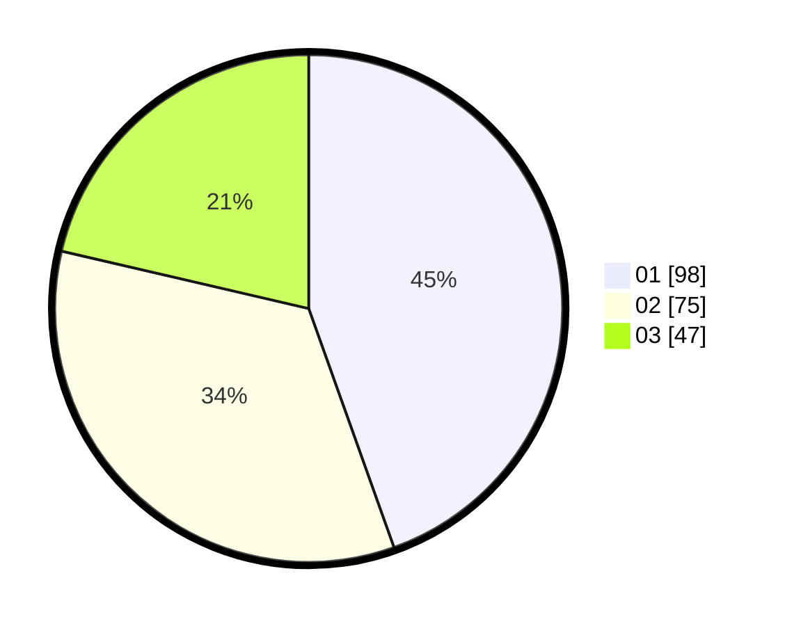

# Hasil

Hasil perolehan suara paslon dapat dilihat pada file paslon-01.txt, paslon-02.txt, dan paslon-03.txt.

Jika tidak ada, artinya data tersebut belum ada pada SIREKAP.

## Perolehan Suara

 * Paslon 01: **98**.
 * Paslon 02: **75**.
 * Paslon 03: **47**.

## Foto C Plano

https://sirekap-obj-formc.kpu.go.id/0bf6/pemilu/ppwp/31/75/01/10/01/3175011001108-20240214-203926--f5b86cdf-9f0b-472c-9c31-dc3bc20ea190.jpg

https://sirekap-obj-formc.kpu.go.id/0bf6/pemilu/ppwp/31/75/01/10/01/3175011001108-20240214-203928--9e62e796-7f29-4a81-b6fc-8ef7eb2c2659.jpg

https://sirekap-obj-formc.kpu.go.id/0bf6/pemilu/ppwp/31/75/01/10/01/3175011001108-20240214-203931--6ce977dc-6f81-4d0b-b256-5fadf2c1fdad.jpg
