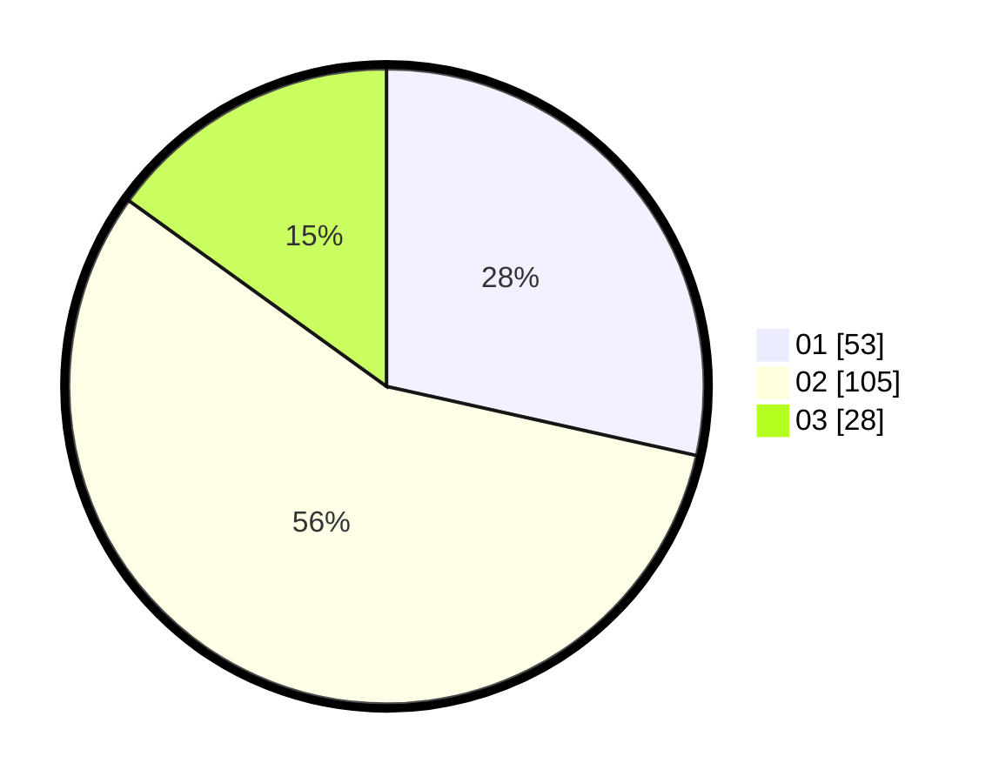

# Hasil

Hasil perolehan suara paslon dapat dilihat pada file paslon-01.txt, paslon-02.txt, dan paslon-03.txt.

Jika tidak ada, artinya data tersebut belum ada pada SIREKAP.

## Perolehan Suara

 * Paslon 01: **53**.
 * Paslon 02: **105**.
 * Paslon 03: **28**.

## Foto C Plano

https://sirekap-obj-formc.kpu.go.id/50c2/pemilu/ppwp/31/75/01/10/02/3175011002001-20240216-145327--22df4968-5d9c-4df3-a4fc-2b47cc1354af.jpg

https://sirekap-obj-formc.kpu.go.id/50c2/pemilu/ppwp/31/75/01/10/02/3175011002001-20240216-145328--3b87e580-250f-4919-aca1-06a048201fd7.jpg

https://sirekap-obj-formc.kpu.go.id/50c2/pemilu/ppwp/31/75/01/10/02/3175011002001-20240216-145327--86f53600-459b-4902-a8f4-0bab5a64056e.jpg

## DATA PEMILIH TETAP

Jumlah pemilih dalam DPT: **179**.
 * L: **87**.
 * P: **92**.

## DATA PENGGUNA HAK PILIH

Jumlah pengguna hak pilih dalam DPT: **179**.
 * L: **87**.
 * P: **92**.

Jumlah pengguna hak pilih dalam DPTb: **7**.
 * L: **3**.
 * P: **4**.

Jumlah pengguna hak pilih dalam DPK: **0**.
 * L: **0**.
 * P: **0**.

Jumlah pengguna hak pilih: **186**.
 * L: **90**.
 * P: **96**.

## JUMLAH SUARA SAH DAN TIDAK SAH

JUMLAH SELURUH SUARA SAH: **186**.

JUMLAH SUARA TIDAK SAH: **0**.

JUMLAH SELURUH SUARA SAH DAN SUARA TIDAK SAH: **186**.
