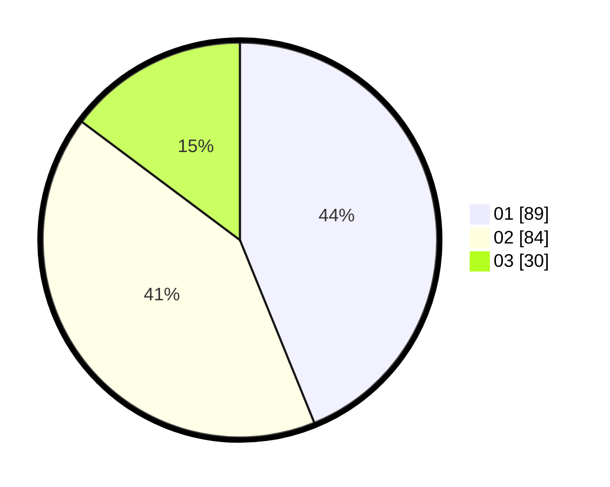

# Hasil

Hasil perolehan suara paslon dapat dilihat pada file paslon-01.txt, paslon-02.txt, dan paslon-03.txt.

Jika tidak ada, artinya data tersebut belum ada pada SIREKAP.

## Perolehan Suara

 * Paslon 01: **89**.
 * Paslon 02: **84**.
 * Paslon 03: **30**.

## Foto C Plano

https://sirekap-obj-formc.kpu.go.id/627d/pemilu/ppwp/31/75/01/10/02/3175011002008-20240215-003352--7886f616-ccce-478f-8520-263f5f325c43.jpg

https://sirekap-obj-formc.kpu.go.id/627d/pemilu/ppwp/31/75/01/10/02/3175011002008-20240215-003457--a54fc1a3-b226-4567-8068-fdb439889463.jpg

https://sirekap-obj-formc.kpu.go.id/627d/pemilu/ppwp/31/75/01/10/02/3175011002008-20240215-003543--7cf23738-0c59-44de-902a-de07aa12394c.jpg
