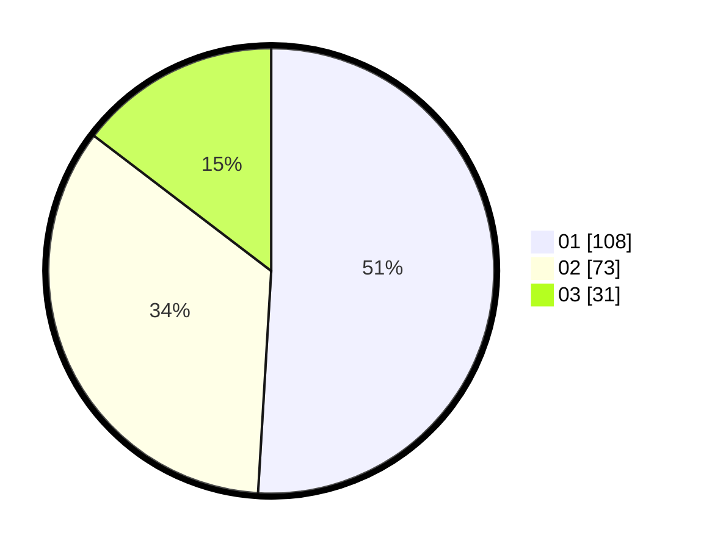

# Hasil

Hasil perolehan suara paslon dapat dilihat pada file paslon-01.txt, paslon-02.txt, dan paslon-03.txt.

Jika tidak ada, artinya data tersebut belum ada pada SIREKAP.

## Perolehan Suara

 * Paslon 01: **108**.
 * Paslon 02: **73**.
 * Paslon 03: **31**.

## Foto C Plano

https://sirekap-obj-formc.kpu.go.id/79a5/pemilu/ppwp/31/75/01/10/02/3175011002009-20240216-085402--de613c8a-4f38-469e-a919-2fc93e7e18a1.jpg

https://sirekap-obj-formc.kpu.go.id/79a5/pemilu/ppwp/31/75/01/10/02/3175011002009-20240216-085404--7e5e6c55-07bd-451e-9cdd-da7ee006fbea.jpg

https://sirekap-obj-formc.kpu.go.id/79a5/pemilu/ppwp/31/75/01/10/02/3175011002009-20240216-085403--402836cb-b5fb-459a-a006-a8a1602e9749.jpg

## DATA PEMILIH TETAP

Jumlah pemilih dalam DPT: **259**.
 * L: **133**.
 * P: **126**.

## DATA PENGGUNA HAK PILIH

Jumlah pengguna hak pilih dalam DPT: **209**.
 * L: **106**.
 * P: **103**.

Jumlah pengguna hak pilih dalam DPTb: **4**.
 * L: **2**.
 * P: **2**.

Jumlah pengguna hak pilih dalam DPK: **1**.
 * L: **0**.
 * P: **1**.

Jumlah pengguna hak pilih: **214**.
 * L: **108**.
 * P: **106**.

## JUMLAH SUARA SAH DAN TIDAK SAH

JUMLAH SELURUH SUARA SAH: **212**.

JUMLAH SUARA TIDAK SAH: **2**.

JUMLAH SELURUH SUARA SAH DAN SUARA TIDAK SAH: **214**.
