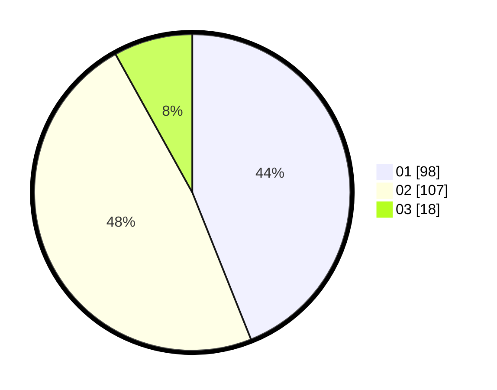

# Hasil

Hasil perolehan suara paslon dapat dilihat pada file paslon-01.txt, paslon-02.txt, dan paslon-03.txt.

Jika tidak ada, artinya data tersebut belum ada pada SIREKAP.

## Perolehan Suara

 * Paslon 01: **98**.
 * Paslon 02: **107**.
 * Paslon 03: **18**.

## Foto C Plano

https://sirekap-obj-formc.kpu.go.id/1bd6/pemilu/ppwp/31/75/01/10/02/3175011002012-20240214-202035--2f9a2b73-4258-4c14-a817-a59b41b65bc0.jpg

https://sirekap-obj-formc.kpu.go.id/1bd6/pemilu/ppwp/31/75/01/10/02/3175011002012-20240214-205044--84e2a413-ee28-46a8-9ffe-bc7c91afa0c9.jpg

https://sirekap-obj-formc.kpu.go.id/1bd6/pemilu/ppwp/31/75/01/10/02/3175011002012-20240214-201101--4c8946de-cfce-43f5-923c-fddb9f8e6fd4.jpg

## DATA PEMILIH TETAP

Jumlah pemilih dalam DPT: **278**.
 * L: **132**.
 * P: **146**.

## DATA PENGGUNA HAK PILIH

Jumlah pengguna hak pilih dalam DPT: **222**.
 * L: **107**.
 * P: **115**.

Jumlah pengguna hak pilih dalam DPTb: **1**.
 * L: **0**.
 * P: **1**.

Jumlah pengguna hak pilih dalam DPK: **7**.
 * L: **4**.
 * P: **3**.

Jumlah pengguna hak pilih: **230**.
 * L: **111**.
 * P: **119**.

## JUMLAH SUARA SAH DAN TIDAK SAH

JUMLAH SELURUH SUARA SAH: **223**.

JUMLAH SUARA TIDAK SAH: **7**.

JUMLAH SELURUH SUARA SAH DAN SUARA TIDAK SAH: **230**.
