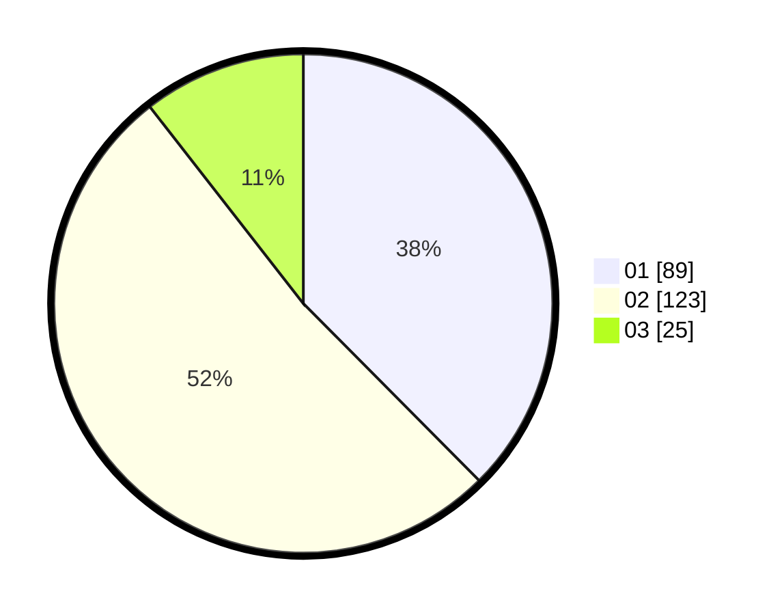

# Hasil

Hasil perolehan suara paslon dapat dilihat pada file paslon-01.txt, paslon-02.txt, dan paslon-03.txt.

Jika tidak ada, artinya data tersebut belum ada pada SIREKAP.

## Perolehan Suara

 * Paslon 01: **89**.
 * Paslon 02: **123**.
 * Paslon 03: **25**.

## Foto C Plano

https://sirekap-obj-formc.kpu.go.id/3de9/pemilu/ppwp/31/75/01/10/02/3175011002021-20240216-134639--25457d72-1c0a-4b7e-918c-abc77883e723.jpg

https://sirekap-obj-formc.kpu.go.id/3de9/pemilu/ppwp/31/75/01/10/02/3175011002021-20240216-134640--d91ccb3d-ecff-4ca1-85f4-292fab157570.jpg

https://sirekap-obj-formc.kpu.go.id/3de9/pemilu/ppwp/31/75/01/10/02/3175011002021-20240216-134639--2c14234d-856f-4601-8953-46671371050d.jpg

## DATA PEMILIH TETAP

Jumlah pemilih dalam DPT: **282**.
 * L: **151**.
 * P: **131**.

## DATA PENGGUNA HAK PILIH

Jumlah pengguna hak pilih dalam DPT: **229**.
 * L: **114**.
 * P: **115**.

Jumlah pengguna hak pilih dalam DPTb: **2**.
 * L: **1**.
 * P: **1**.

Jumlah pengguna hak pilih dalam DPK: **8**.
 * L: **3**.
 * P: **5**.

Jumlah pengguna hak pilih: **239**.
 * L: **118**.
 * P: **121**.

## JUMLAH SUARA SAH DAN TIDAK SAH

JUMLAH SELURUH SUARA SAH: **237**.

JUMLAH SUARA TIDAK SAH: **2**.

JUMLAH SELURUH SUARA SAH DAN SUARA TIDAK SAH: **239**.
