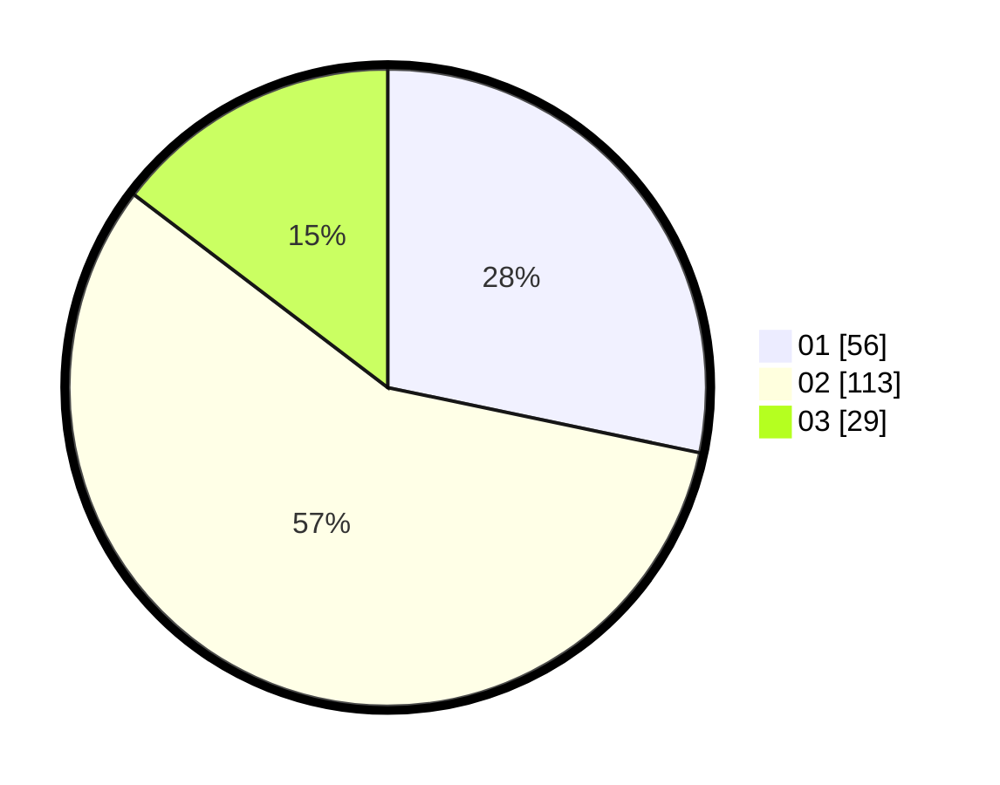

# Hasil

Hasil perolehan suara paslon dapat dilihat pada file paslon-01.txt, paslon-02.txt, dan paslon-03.txt.

Jika tidak ada, artinya data tersebut belum ada pada SIREKAP.

## Perolehan Suara

 * Paslon 01: **56**.
 * Paslon 02: **113**.
 * Paslon 03: **29**.

## Foto C Plano

https://sirekap-obj-formc.kpu.go.id/a9b0/pemilu/ppwp/31/75/01/10/02/3175011002024-20240216-145620--51c492a3-02c3-47d1-b5ad-7fb798a4661a.jpg

https://sirekap-obj-formc.kpu.go.id/a9b0/pemilu/ppwp/31/75/01/10/02/3175011002024-20240216-145622--9889527b-28e1-4894-9a66-352132cea280.jpg

https://sirekap-obj-formc.kpu.go.id/a9b0/pemilu/ppwp/31/75/01/10/02/3175011002024-20240216-145621--f78245f5-bdfd-4cae-9236-99ee7e0e17f6.jpg

## DATA PEMILIH TETAP

Jumlah pemilih dalam DPT: **280**.
 * L: **143**.
 * P: **137**.

## DATA PENGGUNA HAK PILIH

Jumlah pengguna hak pilih dalam DPT: **200**.
 * L: **103**.
 * P: **97**.

Jumlah pengguna hak pilih dalam DPTb: **0**.
 * L: **0**.
 * P: **0**.

Jumlah pengguna hak pilih dalam DPK: **0**.
 * L: **0**.
 * P: **0**.

Jumlah pengguna hak pilih: **200**.
 * L: **103**.
 * P: **97**.

## JUMLAH SUARA SAH DAN TIDAK SAH

JUMLAH SELURUH SUARA SAH: **198**.

JUMLAH SUARA TIDAK SAH: **2**.

JUMLAH SELURUH SUARA SAH DAN SUARA TIDAK SAH: **200**.
