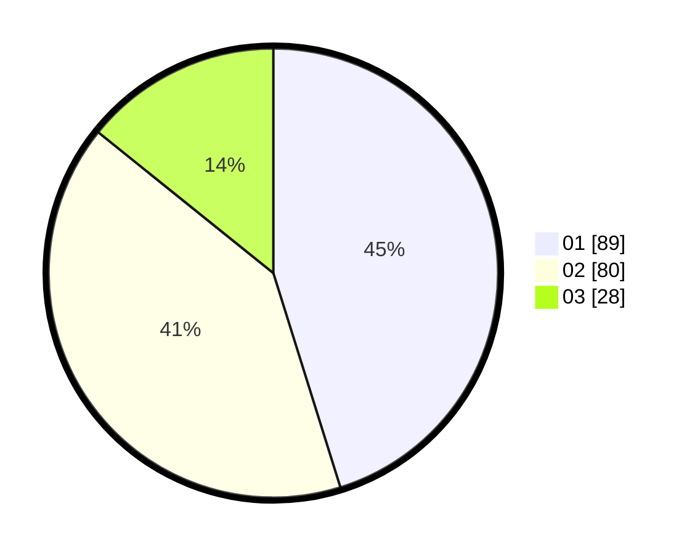

# Hasil

Hasil perolehan suara paslon dapat dilihat pada file paslon-01.txt, paslon-02.txt, dan paslon-03.txt.

Jika tidak ada, artinya data tersebut belum ada pada SIREKAP.

## Perolehan Suara

 * Paslon 01: **89**.
 * Paslon 02: **80**.
 * Paslon 03: **28**.

## Foto C Plano

https://sirekap-obj-formc.kpu.go.id/7cf5/pemilu/ppwp/31/75/01/10/02/3175011002034-20240215-021948--6b7f2679-255f-4207-8b22-fe68ad8d65f0.jpg

https://sirekap-obj-formc.kpu.go.id/7cf5/pemilu/ppwp/31/75/01/10/02/3175011002034-20240214-194938--7c380ddc-f938-4053-89b5-7a0b681f52a4.jpg

https://sirekap-obj-formc.kpu.go.id/7cf5/pemilu/ppwp/31/75/01/10/02/3175011002034-20240214-194955--e444bd67-8767-490f-82aa-ff9218fdca3c.jpg
