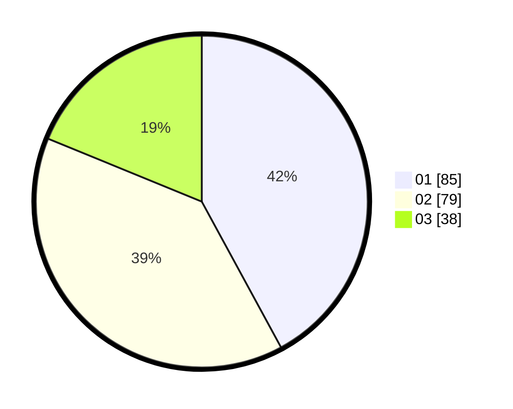

# Hasil

Hasil perolehan suara paslon dapat dilihat pada file paslon-01.txt, paslon-02.txt, dan paslon-03.txt.

Jika tidak ada, artinya data tersebut belum ada pada SIREKAP.

## Perolehan Suara

 * Paslon 01: **85**.
 * Paslon 02: **79**.
 * Paslon 03: **38**.

## Foto C Plano

https://sirekap-obj-formc.kpu.go.id/1818/pemilu/ppwp/31/75/01/10/02/3175011002040-20240216-150300--f73073c8-6fb1-46d1-b497-2be0b35e948b.jpg

https://sirekap-obj-formc.kpu.go.id/1818/pemilu/ppwp/31/75/01/10/02/3175011002040-20240216-150301--ea2ad736-1739-41a7-9e01-c0c82d6521fc.jpg

https://sirekap-obj-formc.kpu.go.id/1818/pemilu/ppwp/31/75/01/10/02/3175011002040-20240216-150301--d492d76a-88db-4d13-ad5a-85ac68f786c2.jpg

## DATA PEMILIH TETAP

Jumlah pemilih dalam DPT: **257**.
 * L: **120**.
 * P: **137**.

## DATA PENGGUNA HAK PILIH

Jumlah pengguna hak pilih dalam DPT: **194**.
 * L: **90**.
 * P: **104**.

Jumlah pengguna hak pilih dalam DPTb: **4**.
 * L: **2**.
 * P: **2**.

Jumlah pengguna hak pilih dalam DPK: **6**.
 * L: **4**.
 * P: **2**.

Jumlah pengguna hak pilih: **204**.
 * L: **96**.
 * P: **108**.

## JUMLAH SUARA SAH DAN TIDAK SAH

JUMLAH SELURUH SUARA SAH: **202**.

JUMLAH SUARA TIDAK SAH: **2**.

JUMLAH SELURUH SUARA SAH DAN SUARA TIDAK SAH: **204**.
