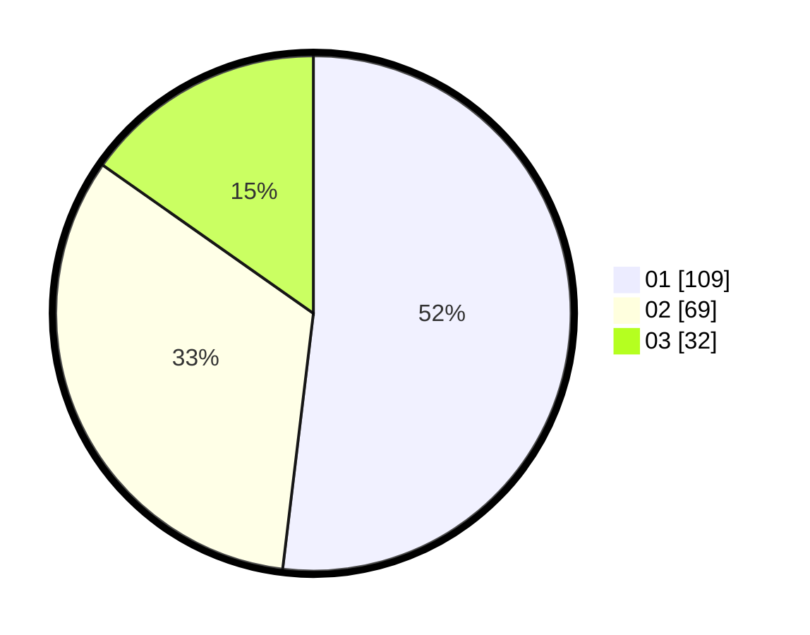

# Hasil

Hasil perolehan suara paslon dapat dilihat pada file paslon-01.txt, paslon-02.txt, dan paslon-03.txt.

Jika tidak ada, artinya data tersebut belum ada pada SIREKAP.

## Perolehan Suara

 * Paslon 01: **109**.
 * Paslon 02: **69**.
 * Paslon 03: **32**.

## Foto C Plano

https://sirekap-obj-formc.kpu.go.id/6194/pemilu/ppwp/31/75/01/10/02/3175011002045-20240215-005813--f0d0c360-c108-42e3-a081-d810e447023c.jpg

https://sirekap-obj-formc.kpu.go.id/6194/pemilu/ppwp/31/75/01/10/02/3175011002045-20240215-005904--40d7aa94-9a7b-4313-9cab-1e82e2791707.jpg

https://sirekap-obj-formc.kpu.go.id/6194/pemilu/ppwp/31/75/01/10/02/3175011002045-20240215-005940--2f9abb3d-78a5-4394-b5a6-82167017d957.jpg
