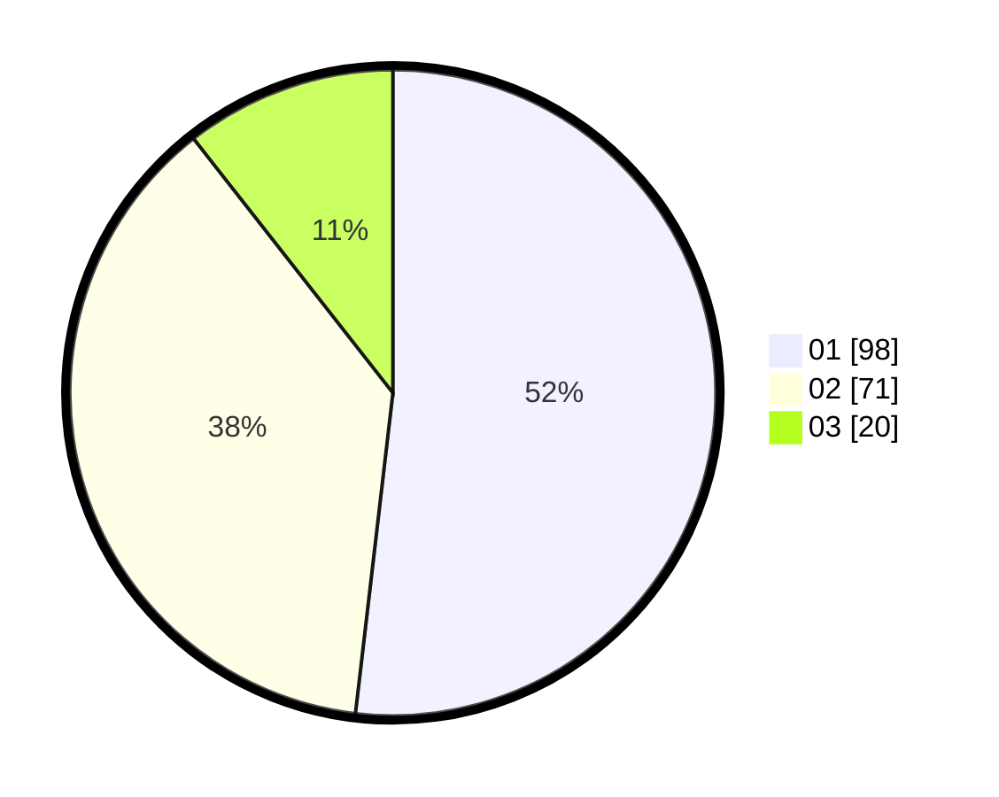

# Hasil

Hasil perolehan suara paslon dapat dilihat pada file paslon-01.txt, paslon-02.txt, dan paslon-03.txt.

Jika tidak ada, artinya data tersebut belum ada pada SIREKAP.

## Perolehan Suara

 * Paslon 01: **98**.
 * Paslon 02: **71**.
 * Paslon 03: **20**.

## Foto C Plano

https://sirekap-obj-formc.kpu.go.id/6270/pemilu/ppwp/31/75/01/10/02/3175011002048-20240214-214906--f1caa6bb-07c4-4591-b72f-8a4abf8c897b.jpg

https://sirekap-obj-formc.kpu.go.id/6270/pemilu/ppwp/31/75/01/10/02/3175011002048-20240214-215001--96169419-aa9b-4680-9854-2ec0116f3770.jpg

https://sirekap-obj-formc.kpu.go.id/6270/pemilu/ppwp/31/75/01/10/02/3175011002048-20240214-215050--488ad9dc-907f-4486-b565-9d96248c585e.jpg
