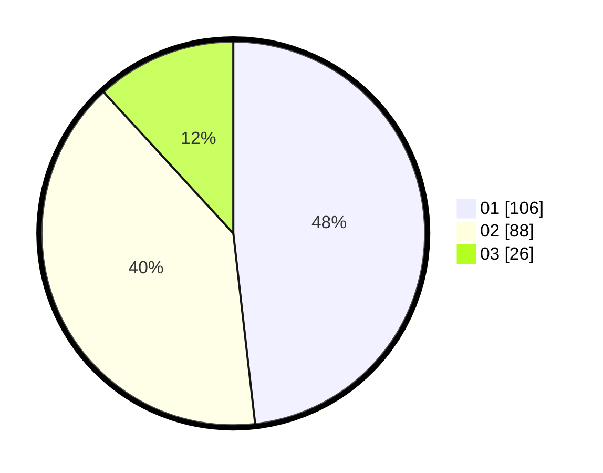

# Hasil

Hasil perolehan suara paslon dapat dilihat pada file paslon-01.txt, paslon-02.txt, dan paslon-03.txt.

Jika tidak ada, artinya data tersebut belum ada pada SIREKAP.

## Perolehan Suara

 * Paslon 01: **106**.
 * Paslon 02: **88**.
 * Paslon 03: **26**.

## Foto C Plano

https://sirekap-obj-formc.kpu.go.id/7b7b/pemilu/ppwp/31/75/01/10/02/3175011002056-20240214-191855--14e43c56-1487-40e5-99b2-a070b228e017.jpg

https://sirekap-obj-formc.kpu.go.id/7b7b/pemilu/ppwp/31/75/01/10/02/3175011002056-20240214-191147--15fd3ccf-3754-4932-b075-a72625077d63.jpg

https://sirekap-obj-formc.kpu.go.id/7b7b/pemilu/ppwp/31/75/01/10/02/3175011002056-20240214-191456--a7d99828-1e7d-4705-946d-f9cc5dd10d82.jpg

## DATA PEMILIH TETAP

Jumlah pemilih dalam DPT: **278**.
 * L: **143**.
 * P: **135**.

## DATA PENGGUNA HAK PILIH

Jumlah pengguna hak pilih dalam DPT: **220**.
 * L: **105**.
 * P: **115**.

Jumlah pengguna hak pilih dalam DPTb: **5**.
 * L: **2**.
 * P: **3**.

Jumlah pengguna hak pilih dalam DPK: **0**.
 * L: **0**.
 * P: **0**.

Jumlah pengguna hak pilih: **225**.
 * L: **107**.
 * P: **118**.

## JUMLAH SUARA SAH DAN TIDAK SAH

JUMLAH SELURUH SUARA SAH: **220**.

JUMLAH SUARA TIDAK SAH: **5**.

JUMLAH SELURUH SUARA SAH DAN SUARA TIDAK SAH: **225**.
