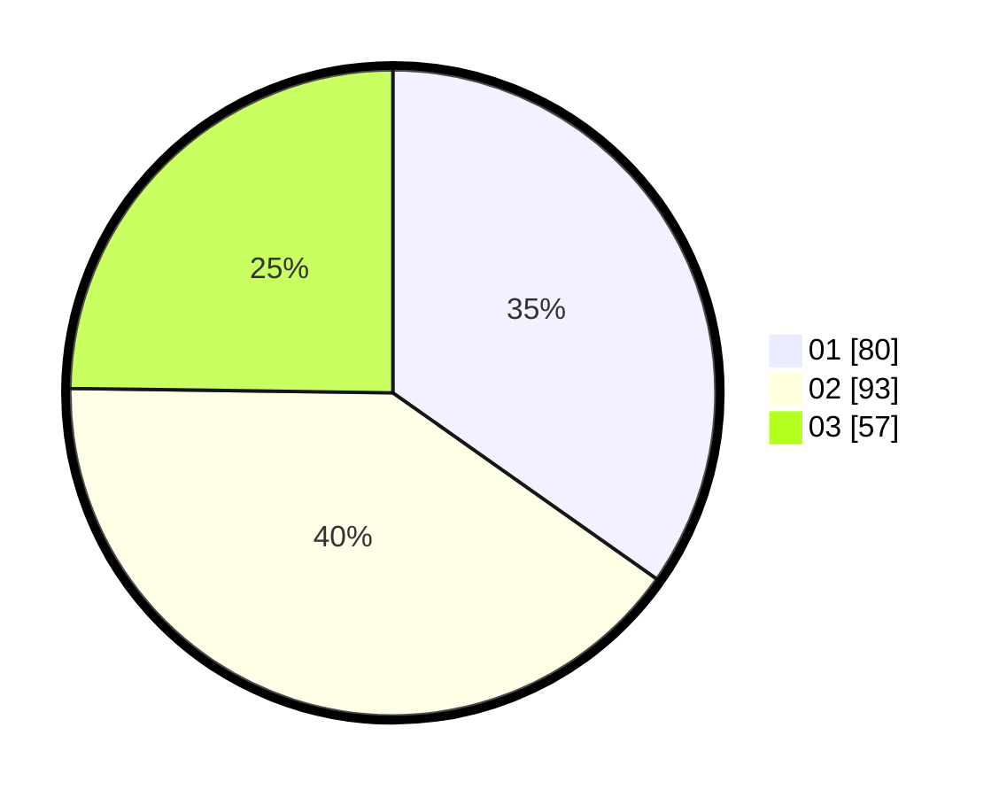

# Hasil

Hasil perolehan suara paslon dapat dilihat pada file paslon-01.txt, paslon-02.txt, dan paslon-03.txt.

Jika tidak ada, artinya data tersebut belum ada pada SIREKAP.

## Perolehan Suara

 * Paslon 01: **80**.
 * Paslon 02: **93**.
 * Paslon 03: **57**.

## Foto C Plano

https://sirekap-obj-formc.kpu.go.id/7cdf/pemilu/ppwp/31/75/01/10/02/3175011002058-20240215-024141--5be3dc8e-17cc-421b-b551-6c79c55c43b1.jpg

https://sirekap-obj-formc.kpu.go.id/7cdf/pemilu/ppwp/31/75/01/10/02/3175011002058-20240215-024254--f127f972-4b52-40c9-9105-c8be4a3ec13a.jpg

https://sirekap-obj-formc.kpu.go.id/7cdf/pemilu/ppwp/31/75/01/10/02/3175011002058-20240215-024335--5a19f087-c430-48e8-9aab-a5dcb6738dca.jpg
