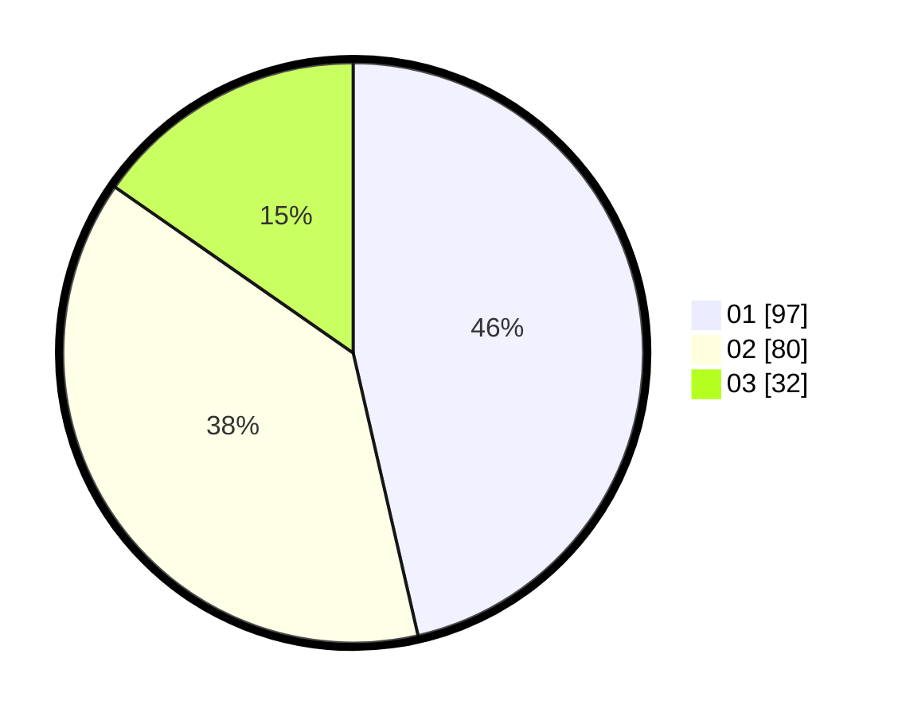

# Hasil

Hasil perolehan suara paslon dapat dilihat pada file paslon-01.txt, paslon-02.txt, dan paslon-03.txt.

Jika tidak ada, artinya data tersebut belum ada pada SIREKAP.

## Perolehan Suara

 * Paslon 01: **97**.
 * Paslon 02: **80**.
 * Paslon 03: **32**.

## Foto C Plano

https://sirekap-obj-formc.kpu.go.id/ef6a/pemilu/ppwp/31/75/01/10/02/3175011002061-20240215-220150--9a1f41d9-1516-4217-9aa5-517071639a85.jpg

https://sirekap-obj-formc.kpu.go.id/ef6a/pemilu/ppwp/31/75/01/10/02/3175011002061-20240215-220152--beede1c3-925e-4565-9ab9-9b5dce92777c.jpg

https://sirekap-obj-formc.kpu.go.id/ef6a/pemilu/ppwp/31/75/01/10/02/3175011002061-20240215-220151--c8202f57-d162-44aa-84d3-8db42ebaf81a.jpg

## DATA PEMILIH TETAP

Jumlah pemilih dalam DPT: **275**.
 * L: **132**.
 * P: **143**.

## DATA PENGGUNA HAK PILIH

Jumlah pengguna hak pilih dalam DPT: **207**.
 * L: **98**.
 * P: **109**.

Jumlah pengguna hak pilih dalam DPTb: **3**.
 * L: **3**.
 * P: **0**.

Jumlah pengguna hak pilih dalam DPK: **4**.
 * L: **2**.
 * P: **2**.

Jumlah pengguna hak pilih: **214**.
 * L: **103**.
 * P: **111**.

## JUMLAH SUARA SAH DAN TIDAK SAH

JUMLAH SELURUH SUARA SAH: **209**.

JUMLAH SUARA TIDAK SAH: **5**.

JUMLAH SELURUH SUARA SAH DAN SUARA TIDAK SAH: **214**.
