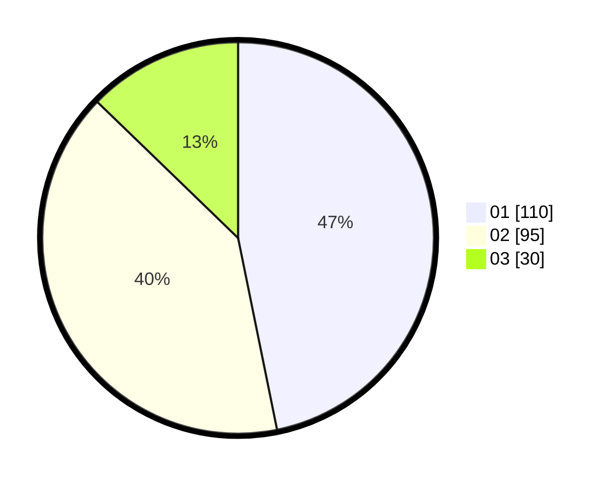

# Hasil

Hasil perolehan suara paslon dapat dilihat pada file paslon-01.txt, paslon-02.txt, dan paslon-03.txt.

Jika tidak ada, artinya data tersebut belum ada pada SIREKAP.

## Perolehan Suara

 * Paslon 01: **110**.
 * Paslon 02: **95**.
 * Paslon 03: **30**.

## Foto C Plano

https://sirekap-obj-formc.kpu.go.id/47f6/pemilu/ppwp/31/75/01/10/02/3175011002063-20240214-190612--237a44bc-1d2f-40fb-8580-2ef3852928d4.jpg

https://sirekap-obj-formc.kpu.go.id/47f6/pemilu/ppwp/31/75/01/10/02/3175011002063-20240214-190154--8d478d71-8090-4b70-bb26-ba30b5f74569.jpg

https://sirekap-obj-formc.kpu.go.id/47f6/pemilu/ppwp/31/75/01/10/02/3175011002063-20240216-075743--c398fae5-3929-46eb-90dc-f2857f4921b5.jpg

## DATA PEMILIH TETAP

Jumlah pemilih dalam DPT: **280**.
 * L: **143**.
 * P: **137**.

## DATA PENGGUNA HAK PILIH

Jumlah pengguna hak pilih dalam DPT: **215**.
 * L: **108**.
 * P: **107**.

Jumlah pengguna hak pilih dalam DPTb: **19**.
 * L: **7**.
 * P: **12**.

Jumlah pengguna hak pilih dalam DPK: **2**.
 * L: **1**.
 * P: **1**.

Jumlah pengguna hak pilih: **236**.
 * L: **116**.
 * P: **120**.

## JUMLAH SUARA SAH DAN TIDAK SAH

JUMLAH SELURUH SUARA SAH: **235**.

JUMLAH SUARA TIDAK SAH: **1**.

JUMLAH SELURUH SUARA SAH DAN SUARA TIDAK SAH: **236**.
