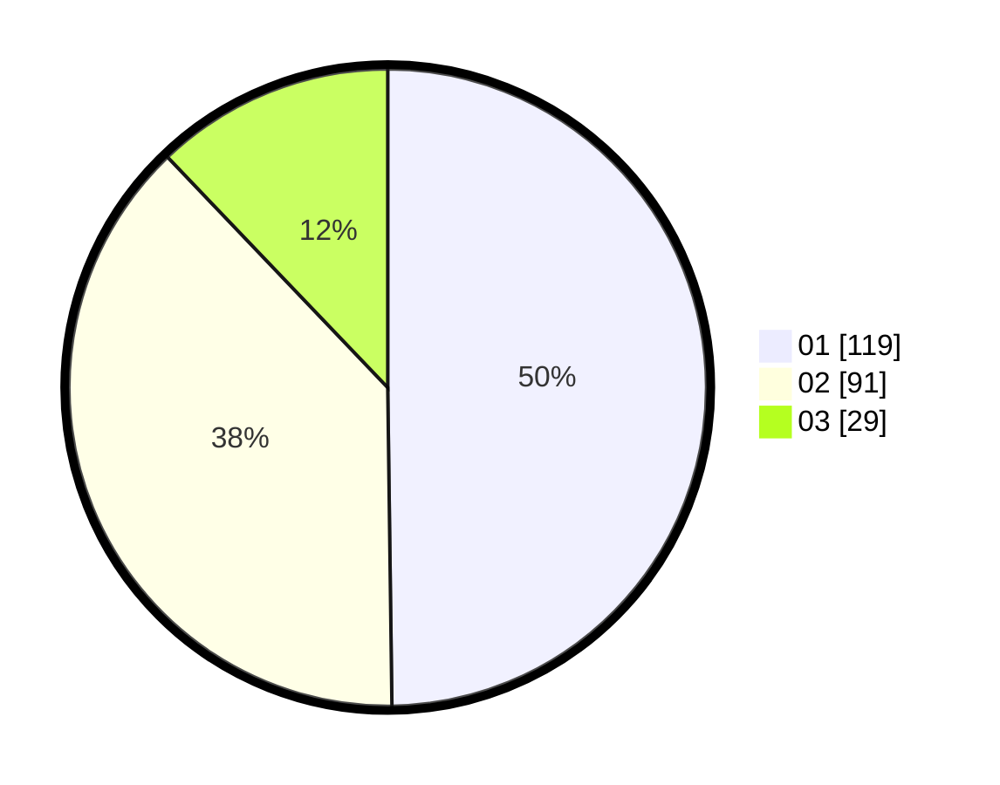

# Hasil

Hasil perolehan suara paslon dapat dilihat pada file paslon-01.txt, paslon-02.txt, dan paslon-03.txt.

Jika tidak ada, artinya data tersebut belum ada pada SIREKAP.

## Perolehan Suara

 * Paslon 01: **119**.
 * Paslon 02: **91**.
 * Paslon 03: **29**.

## Foto C Plano

https://sirekap-obj-formc.kpu.go.id/859a/pemilu/ppwp/31/75/01/10/02/3175011002066-20240214-223304--16bbb0b0-5940-44c2-9c8c-8e86721fff1a.jpg

https://sirekap-obj-formc.kpu.go.id/859a/pemilu/ppwp/31/75/01/10/02/3175011002066-20240214-223003--56a6d949-6c48-42e5-8c9d-660b5968fe70.jpg

https://sirekap-obj-formc.kpu.go.id/859a/pemilu/ppwp/31/75/01/10/02/3175011002066-20240214-222354--d577990a-4715-40ef-a944-f39944507b1e.jpg
