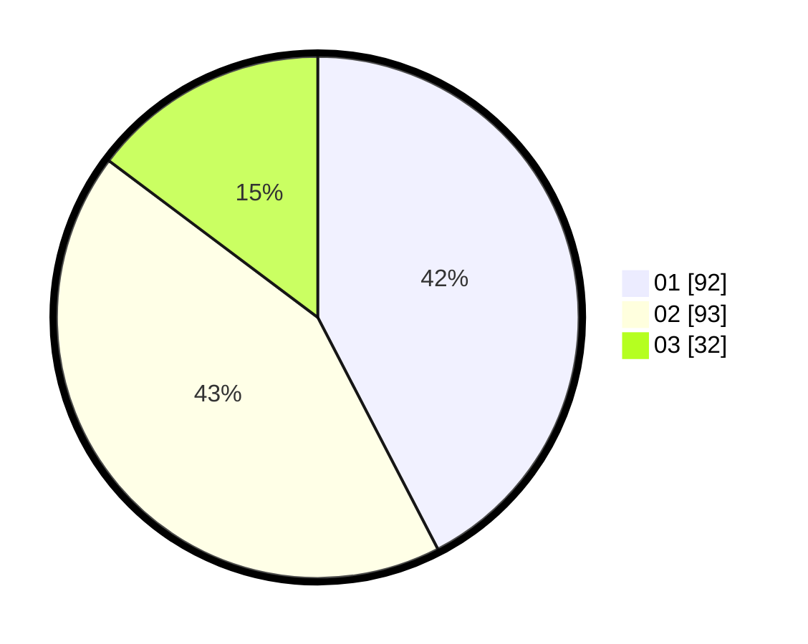

# Hasil

Hasil perolehan suara paslon dapat dilihat pada file paslon-01.txt, paslon-02.txt, dan paslon-03.txt.

Jika tidak ada, artinya data tersebut belum ada pada SIREKAP.

## Perolehan Suara

 * Paslon 01: **92**.
 * Paslon 02: **93**.
 * Paslon 03: **32**.

## Foto C Plano

https://sirekap-obj-formc.kpu.go.id/5deb/pemilu/ppwp/31/75/01/10/02/3175011002067-20240214-155738--e5ba6791-0de2-4038-97cc-d0b5a2d744fd.jpg

https://sirekap-obj-formc.kpu.go.id/5deb/pemilu/ppwp/31/75/01/10/02/3175011002067-20240214-155847--b9cb216e-4e45-40a4-a392-a57002927c9d.jpg

https://sirekap-obj-formc.kpu.go.id/5deb/pemilu/ppwp/31/75/01/10/02/3175011002067-20240214-155501--2562dd65-3a40-4b80-9fe9-64c508109d29.jpg
