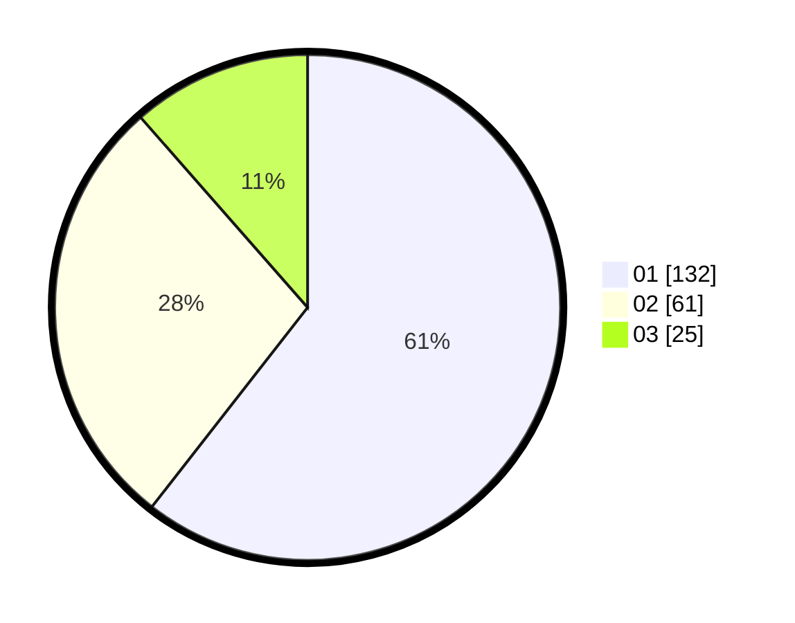

# Hasil

Hasil perolehan suara paslon dapat dilihat pada file paslon-01.txt, paslon-02.txt, dan paslon-03.txt.

Jika tidak ada, artinya data tersebut belum ada pada SIREKAP.

## Perolehan Suara

 * Paslon 01: **132**.
 * Paslon 02: **61**.
 * Paslon 03: **25**.

## Foto C Plano

https://sirekap-obj-formc.kpu.go.id/369c/pemilu/ppwp/31/75/01/10/02/3175011002068-20240217-204541--f08bb6a0-332d-4ff6-9ddd-8e9df8800409.jpg

https://sirekap-obj-formc.kpu.go.id/369c/pemilu/ppwp/31/75/01/10/02/3175011002068-20240217-204549--920a32e1-a5f4-4a64-a9c0-cdf56008b47f.jpg

https://sirekap-obj-formc.kpu.go.id/369c/pemilu/ppwp/31/75/01/10/02/3175011002068-20240217-204554--ad673cbd-1710-4e36-986f-39a495190c07.jpg

## DATA PEMILIH TETAP

Jumlah pemilih dalam DPT: **271**.
 * L: **140**.
 * P: **131**.

## DATA PENGGUNA HAK PILIH

Jumlah pengguna hak pilih dalam DPT: **211**.
 * L: **104**.
 * P: **107**.

Jumlah pengguna hak pilih dalam DPTb: **10**.
 * L: **5**.
 * P: **5**.

Jumlah pengguna hak pilih dalam DPK: **1**.
 * L: **1**.
 * P: **0**.

Jumlah pengguna hak pilih: **222**.
 * L: **110**.
 * P: **112**.

## JUMLAH SUARA SAH DAN TIDAK SAH

JUMLAH SELURUH SUARA SAH: **218**.

JUMLAH SUARA TIDAK SAH: **4**.

JUMLAH SELURUH SUARA SAH DAN SUARA TIDAK SAH: **222**.
