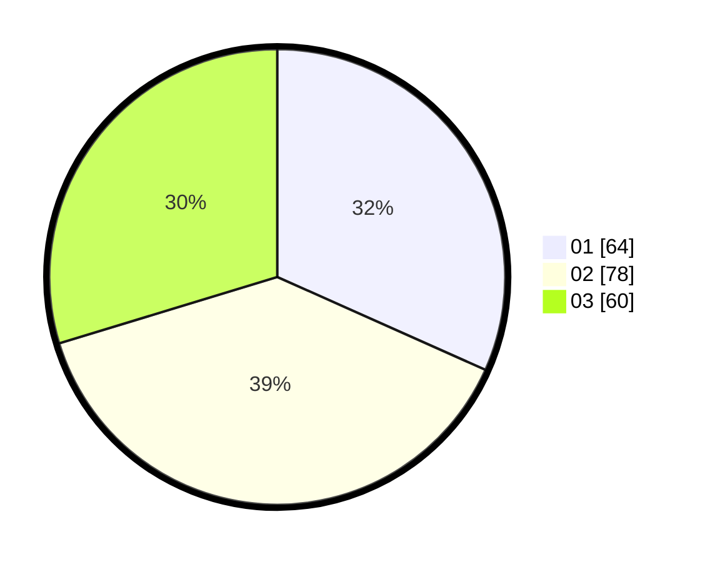

# Hasil

Hasil perolehan suara paslon dapat dilihat pada file paslon-01.txt, paslon-02.txt, dan paslon-03.txt.

Jika tidak ada, artinya data tersebut belum ada pada SIREKAP.

## Perolehan Suara

 * Paslon 01: **64**.
 * Paslon 02: **78**.
 * Paslon 03: **60**.

## Foto C Plano

https://sirekap-obj-formc.kpu.go.id/1871/pemilu/ppwp/31/75/01/10/02/3175011002076-20240215-004623--67573d8d-9d6e-4a80-948b-669777fad08c.jpg

https://sirekap-obj-formc.kpu.go.id/1871/pemilu/ppwp/31/75/01/10/02/3175011002076-20240215-004821--feafb114-8221-4d74-8685-b9e6e1028acd.jpg

https://sirekap-obj-formc.kpu.go.id/1871/pemilu/ppwp/31/75/01/10/02/3175011002076-20240215-005103--7009cb20-9ccd-4453-9ac7-ee0b14af83c8.jpg
