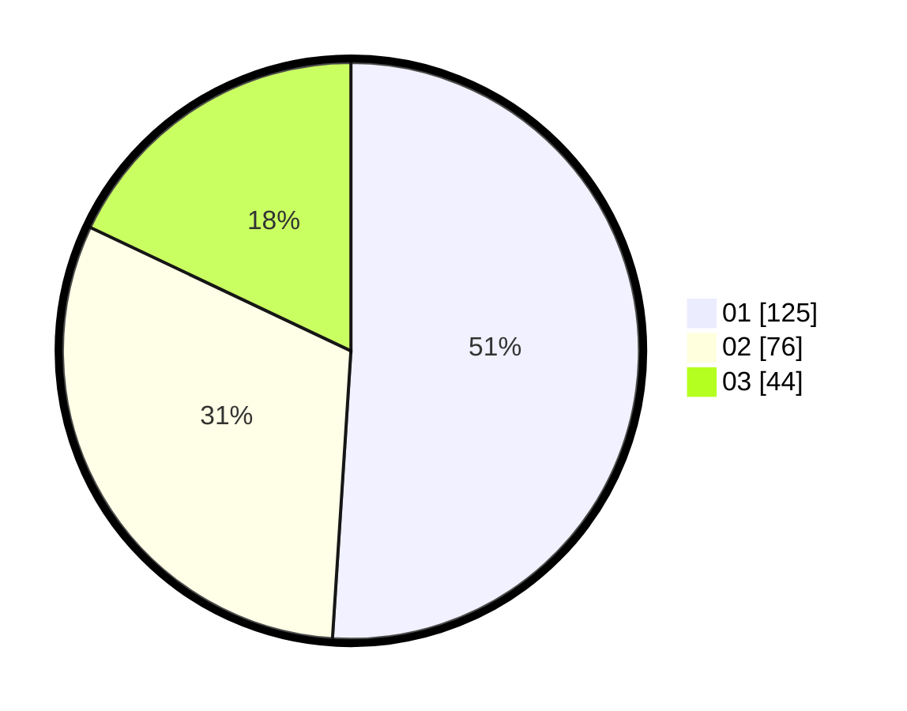

# Hasil

Hasil perolehan suara paslon dapat dilihat pada file paslon-01.txt, paslon-02.txt, dan paslon-03.txt.

Jika tidak ada, artinya data tersebut belum ada pada SIREKAP.

## Perolehan Suara

 * Paslon 01: **125**.
 * Paslon 02: **76**.
 * Paslon 03: **44**.

## Foto C Plano

https://sirekap-obj-formc.kpu.go.id/59b0/pemilu/ppwp/31/75/01/10/02/3175011002087-20240216-133722--e1d6b622-5387-4e1c-85af-877ee053e6ca.jpg

https://sirekap-obj-formc.kpu.go.id/59b0/pemilu/ppwp/31/75/01/10/02/3175011002087-20240216-133724--575b6b7e-fbb3-4f67-baa4-fd343dad1fb9.jpg

https://sirekap-obj-formc.kpu.go.id/59b0/pemilu/ppwp/31/75/01/10/02/3175011002087-20240216-133723--5f192e38-92b2-4ab1-a3f9-f1fb1d25a9ea.jpg

## DATA PEMILIH TETAP

Jumlah pemilih dalam DPT: **285**.
 * L: **142**.
 * P: **143**.

## DATA PENGGUNA HAK PILIH

Jumlah pengguna hak pilih dalam DPT: **244**.
 * L: **117**.
 * P: **127**.

Jumlah pengguna hak pilih dalam DPTb: **5**.
 * L: **5**.
 * P: **0**.

Jumlah pengguna hak pilih dalam DPK: **3**.
 * L: **2**.
 * P: **1**.

Jumlah pengguna hak pilih: **252**.
 * L: **124**.
 * P: **128**.

## JUMLAH SUARA SAH DAN TIDAK SAH

JUMLAH SELURUH SUARA SAH: **245**.

JUMLAH SUARA TIDAK SAH: **4**.

JUMLAH SELURUH SUARA SAH DAN SUARA TIDAK SAH: **249**.
