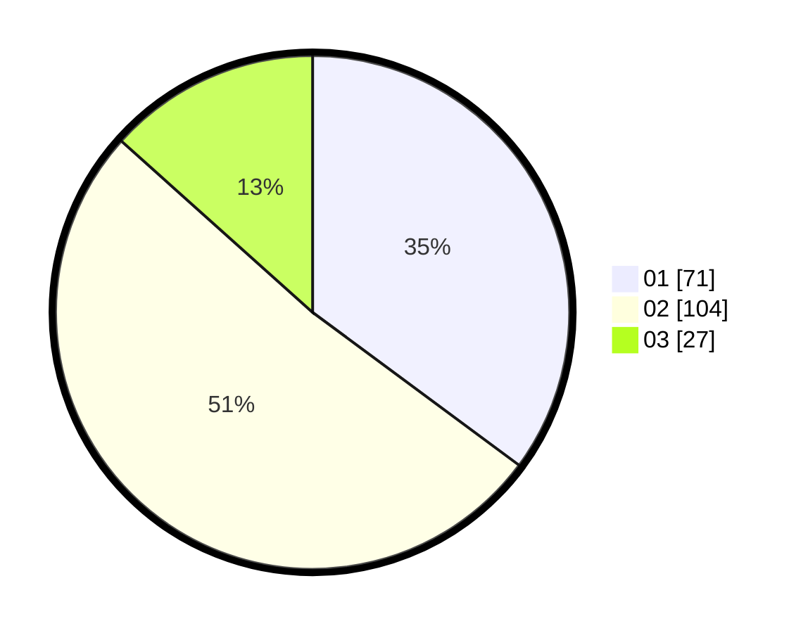

# Hasil

Hasil perolehan suara paslon dapat dilihat pada file paslon-01.txt, paslon-02.txt, dan paslon-03.txt.

Jika tidak ada, artinya data tersebut belum ada pada SIREKAP.

## Perolehan Suara

 * Paslon 01: **71**.
 * Paslon 02: **104**.
 * Paslon 03: **27**.

## Foto C Plano

https://sirekap-obj-formc.kpu.go.id/d07b/pemilu/ppwp/31/75/01/10/02/3175011002092-20240214-215309--b829beaf-799c-4d37-aa08-171db4b64199.jpg

https://sirekap-obj-formc.kpu.go.id/d07b/pemilu/ppwp/31/75/01/10/02/3175011002092-20240214-215445--e019a48e-9368-41b8-8d8e-addd7a294d99.jpg

https://sirekap-obj-formc.kpu.go.id/d07b/pemilu/ppwp/31/75/01/10/02/3175011002092-20240214-215715--3339604e-739d-4e54-8475-3fa2b4b9f240.jpg

## DATA PEMILIH TETAP

Jumlah pemilih dalam DPT: **276**.
 * L: **138**.
 * P: **138**.

## DATA PENGGUNA HAK PILIH

Jumlah pengguna hak pilih dalam DPT: **202**.
 * L: **100**.
 * P: **102**.

Jumlah pengguna hak pilih dalam DPTb: **2**.
 * L: **1**.
 * P: **1**.

Jumlah pengguna hak pilih dalam DPK: **0**.
 * L: **0**.
 * P: **0**.

Jumlah pengguna hak pilih: **204**.
 * L: **101**.
 * P: **103**.

## JUMLAH SUARA SAH DAN TIDAK SAH

JUMLAH SELURUH SUARA SAH: **202**.

JUMLAH SUARA TIDAK SAH: **2**.

JUMLAH SELURUH SUARA SAH DAN SUARA TIDAK SAH: **204**.
