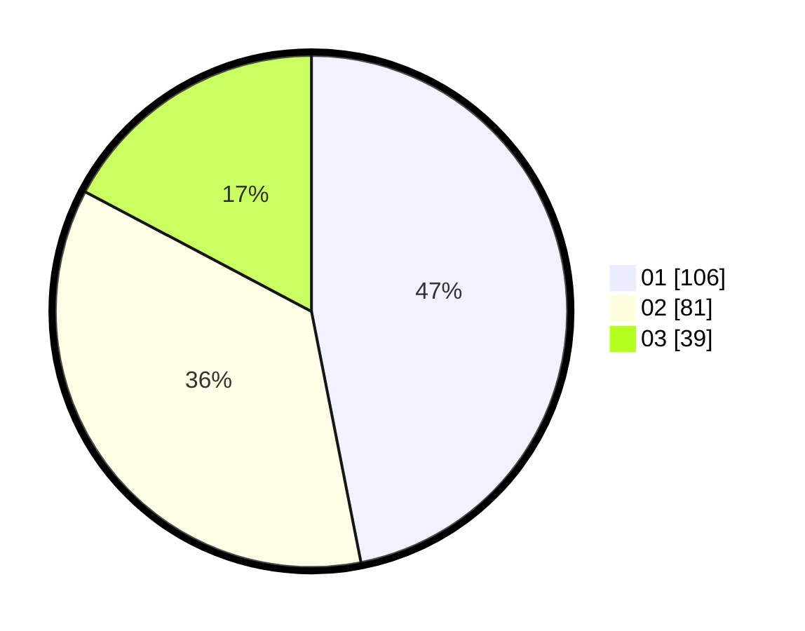

# Hasil

Hasil perolehan suara paslon dapat dilihat pada file paslon-01.txt, paslon-02.txt, dan paslon-03.txt.

Jika tidak ada, artinya data tersebut belum ada pada SIREKAP.

## Perolehan Suara

 * Paslon 01: **106**.
 * Paslon 02: **81**.
 * Paslon 03: **39**.

## Foto C Plano

https://sirekap-obj-formc.kpu.go.id/4de0/pemilu/ppwp/31/75/01/10/02/3175011002093-20240216-150039--3bac914b-7e0a-42a4-8de7-8b6a1f6f3161.jpg

https://sirekap-obj-formc.kpu.go.id/4de0/pemilu/ppwp/31/75/01/10/02/3175011002093-20240216-150041--b48d6eb3-fb71-4c86-a1aa-fb2e5bf88a5a.jpg

https://sirekap-obj-formc.kpu.go.id/4de0/pemilu/ppwp/31/75/01/10/02/3175011002093-20240216-150040--7632c7ba-dc43-42df-b5d2-08220877441f.jpg

## DATA PEMILIH TETAP

Jumlah pemilih dalam DPT: **284**.
 * L: **138**.
 * P: **146**.

## DATA PENGGUNA HAK PILIH

Jumlah pengguna hak pilih dalam DPT: **228**.
 * L: **111**.
 * P: **117**.

Jumlah pengguna hak pilih dalam DPTb: **2**.
 * L: **1**.
 * P: **1**.

Jumlah pengguna hak pilih dalam DPK: **0**.
 * L: **0**.
 * P: **0**.

Jumlah pengguna hak pilih: **230**.
 * L: **112**.
 * P: **118**.

## JUMLAH SUARA SAH DAN TIDAK SAH

JUMLAH SELURUH SUARA SAH: **226**.

JUMLAH SUARA TIDAK SAH: **4**.

JUMLAH SELURUH SUARA SAH DAN SUARA TIDAK SAH: **230**.
